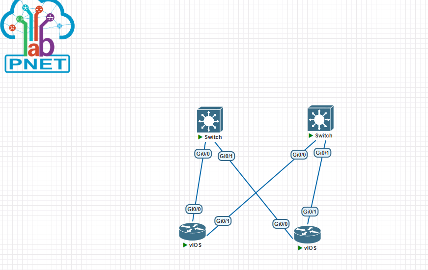

# Лабораторная работа №3. Настройка IS-IS в Underlay-сети фабрики CLOS

**Цель работы:** Настроить протокол динамической маршрутизации IS-IS (Intermediate System to Intermediate System) в Underlay-сети для обеспечения автоматической IP-связности между всеми сетевыми устройствами фабрики CLOS.

---

## 1. Топология сети

Топология полностью наследует архитектуру из предыдущих лабораторных работ, собранную в эмуляторе PNETLab.



* **Spine-уровень:** 2 коммутатора Cisco vIOS L3 (`Spine-01`, `Spine-02`).
* **Leaf-уровень:** 2 роутера Cisco vIOS (`Leaf-01`, `Leaf-02`).
* **Схема подключений:** Каждый Leaf-коммутатор соединён с каждым Spine-коммутатором (full-mesh на уровне Spine-Leaf).

---

## 2. План работ

1. **Анализ существующей конфигурации:** Проверить назначение IP-адресов на всех интерфейсах и Loopback.
2. **Планирование IS-IS:** Выбрать уровень (Level-2), определить System ID для каждого устройства (использовать Loopback-адреса), настроить NET-адреса.
3. **Настройка IS-IS на Spine-коммутаторах:**
   - Включить процесс IS-IS.
   - Настроить NET-адрес.
   - Объявить все P2P-линки и Loopback-интерфейс в IS-IS.
4. **Настройка IS-IS на Leaf-коммутаторах:**
   - Включить процесс IS-IS.
   - Настроить NET-адрес.
   - Объявить все P2P-линки и Loopback-интерфейс в IS-IS.
5. **Верификация:** Проверить установление соседств (IS-IS neighbors) и наличие маршрутов в таблице маршрутизации.
6. **Документирование:** Зафиксировать конфигурации и результаты проверки.

---

## 3. Адресное пространство Underlay (неизменно)

Используется адресное пространство, спроектированное в первой лабораторной работе.

| Устройство | Интерфейс | IP-адрес / Маска | Назначение |
| :--- | :--- | :--- | :--- |
| **Spine-01** | Loopback0 | `10.255.0.1/32` | Router ID / System ID |
| | GigabitEthernet0/0 | `10.0.1.0/31` | p2p-линк к Leaf-01 |
| | GigabitEthernet0/1 | `10.0.1.2/31` | p2p-линк к Leaf-02 |
| **Spine-02** | Loopback0 | `10.255.0.2/32` | Router ID / System ID |
| | GigabitEthernet0/0 | `10.0.2.0/31` | p2p-линк к Leaf-01 |
| | GigabitEthernet0/1 | `10.0.2.2/31` | p2p-линк к Leaf-02 |
| **Leaf-01** | Loopback0 | `10.255.0.11/32` | Router ID / System ID |
| | GigabitEthernet0/0 | `10.0.1.1/31` | p2p-линк к Spine-01 |
| | GigabitEthernet0/1 | `10.0.2.1/31` | p2p-линк к Spine-02 |
| **Leaf-02** | Loopback0 | `10.255.0.12/32` | Router ID / System ID |
| | GigabitEthernet0/0 | `10.0.1.3/31` | p2p-линк к Spine-01 |
| | GigabitEthernet0/1 | `10.0.2.3/31` | p2p-линк к Spine-02 |

---

## 4. Конфигурация оборудования (IS-IS)

Ниже приведены конфигурации для всех устройств. В качестве протокола маршрутизации используется **IS-IS** для IPv4.

### 📌 Планирование NET-адресов

В IS-IS каждый узел идентифицируется по **NET** (Network Entity Title). Формат NET:
<Area ID>.<System ID>.<SEL>

text

* **Area ID:** Используем `49.0001` (все устройства в одной зоне).
* **System ID:** Уникальный идентификатор для каждого устройства (6 байт в шестнадцатеричном формате). Используем последние 6 байт Loopback-адреса:
  - Spine-01: `0100.0000.0001`
  - Spine-02: `0100.0000.0002`
  - Leaf-01: `0100.0000.0011`
  - Leaf-02: `0100.0000.0012`
* **SEL:** Всегда `00` для обычных маршрутизаторов.

Итоговые NET-адреса:

| Устройство | System ID | NET |
| :--- | :--- | :--- |
| Spine-01 | 0100.0000.0001 | `49.0001.0100.0000.0001.00` |
| Spine-02 | 0100.0000.0002 | `49.0001.0100.0000.0002.00` |
| Leaf-01 | 0100.0000.0011 | `49.0001.0100.0000.0011.00` |
| Leaf-02 | 0100.0000.0012 | `49.0001.0100.0000.0012.00` |

### 4.1. Конфигурация Spine-01

```cisco
hostname Spine-01
!
interface Loopback0
 ip address 10.255.0.1 255.255.255.255
 ip router isis
!
interface GigabitEthernet0/0
 no switchport
 ip address 10.0.1.0 255.255.255.254
 ip router isis
 no shutdown
!
interface GigabitEthernet0/1
 no switchport
 ip address 10.0.1.2 255.255.255.254
 ip router isis
 no shutdown
!
router isis
 net 49.0001.0100.0000.0001.00
 is-type level-2-only
 log-adjacency-changes
!
4.2. Конфигурация Spine-02
cisco
hostname Spine-02
!
interface Loopback0
 ip address 10.255.0.2 255.255.255.255
 ip router isis
!
interface GigabitEthernet0/0
 no switchport
 ip address 10.0.2.0 255.255.255.254
 ip router isis
 no shutdown
!
interface GigabitEthernet0/1
 no switchport
 ip address 10.0.2.2 255.255.255.254
 ip router isis
 no shutdown
!
router isis
 net 49.0001.0100.0000.0002.00
 is-type level-2-only
 log-adjacency-changes
!
4.3. Конфигурация Leaf-01
cisco
hostname Leaf-01
!
interface Loopback0
 ip address 10.255.0.11 255.255.255.255
 ip router isis
!
interface GigabitEthernet0/0
 ip address 10.0.1.1 255.255.255.254
 ip router isis
 no shutdown
!
interface GigabitEthernet0/1
 ip address 10.0.2.1 255.255.255.254
 ip router isis
 no shutdown
!
router isis
 net 49.0001.0100.0000.0011.00
 is-type level-2-only
 log-adjacency-changes
!
4.4. Конфигурация Leaf-02
cisco
hostname Leaf-02
!
interface Loopback0
 ip address 10.255.0.12 255.255.255.255
 ip router isis
!
interface GigabitEthernet0/0
 ip address 10.0.1.3 255.255.255.254
 ip router isis
 no shutdown
!
interface GigabitEthernet0/1
 ip address 10.0.2.3 255.255.255.254
 ip router isis
 no shutdown
!
router isis
 net 49.0001.0100.0000.0012.00
 is-type level-2-only
 log-adjacency-changes
!
Примечание: В IS-IS для IPv4 используется команда ip router isis на интерфейсах. Это активирует протокол на интерфейсе и позволяет ему участвовать в обмене маршрутной информацией. Команда is-type level-2-only настраивает устройство на работу только на Level-2 (магистральном уровне), что упрощает топологию.
```
## 5. Верификация и проверка связности
После применения конфигураций необходимо убедиться, что IS-IS установил соседства и таблицы маршрутизации заполнены.

### 5.1. Проверка соседств IS-IS (на примере Spine-01)
```
bash
Spine-01# show isis neighbors

System Id      Type Interface   IP Address      State Holdtime Circuit Id
Leaf-01        L2   Gi0/0       10.0.1.1        UP    26       0000.0000.0011.01
Leaf-02        L2   Gi0/1       10.0.1.3        UP    28       0000.0000.0012.01
```
| Параметр | Значение | Описание |
| :--- | :--- | :--- |
| **System Id** | Leaf-01, Leaf-02 | Идентификаторы соседних устройств |
| **Type** | L2 | Уровень IS-IS (Level-2) |
| **Interface** | Gi0/0, Gi0/1 | Интерфейсы, через которые установлено соседство |
| **IP Address** | 10.0.1.1, 10.0.1.3 | IP-адреса соседних устройств |
| **State** | UP | Статус соседства (активно) |
| **Holdtime** | 26, 28 | Время удержания соседства (в секундах) |
| **Circuit Id** | 0000.0000.0011.01, 0000.0000.0012.01 | Идентификатор цепи |
5.2. Проверка таблицы маршрутизации (на примере Leaf-01)
```bash
Leaf-01# show ip route isis

i L2    10.255.0.2/32 [115/20] via 10.0.2.0, GigabitEthernet0/1
i L2    10.255.0.12/32 [115/20] via 10.0.1.3, GigabitEthernet0/0
                            [115/20] via 10.0.2.3, GigabitEthernet0/1
```
|Параметр|	Значение|	Описание|
|:|:---|:---|
|Метка|	i L2|	IS-IS маршрут уровня Level-2|
|Сеть|	10.255.0.2/32, 10.255.0.12/32|	Сети назначения (Loopback адреса)|
|Метрика	|[115/20]|	Административная дистанция (115) |/ Метрика IS-IS (20)|
|Next Hop|	10.0.2.0, 10.0.1.3, 10.0.2.3|	Адрес следующего шлюза|
|Интерфейс|	GigabitEthernet0/1, GigabitEthernet0/0	|Выходной интерфейс|

Интерпретация: В таблице маршрутизации Leaf-01 появились записи IS-IS:

Маршрут до Loopback Spine-02 (10.255.0.2) через интерфейс Gi0/1 с метрикой 20.

Маршрут до Loopback Leaf-02 (10.255.0.12) через два равнозначных пути (ECMP): через Spine-01 (10.0.1.3) и через Spine-02 (10.0.2.3) с одинаковой метрикой 20. 
Это ключевое преимущество топологии CLOS, реализованное через IS-IS.

5.3. Проверка базы данных IS-IS (LSP)
```
bash
Leaf-01# show isis database

IS-IS Level-2 Link State Database
LSPID                 LSP Seq Num  LSP Checksum  LSP Holdtime      ATT/P/OL
0100.0000.0001.00-00  0x00000007   0x1234        1195              0/0/0
0100.0000.0002.00-00  0x00000007   0x5678        1195              0/0/0
0100.0000.0011.00-00  0x00000007   0x9ABC        1195              0/0/0
0100.0000.0012.00-00  0x00000007   0xDEF0        1195              0/0/0
```
| Параметр | Значение | Описание |
| :--- | :--- | :--- |
| **LSPID** | `0100.0000.0001.00-00` и др. | Идентификатор Link State PDU |
| **LSP Seq Num** | `0x00000007` | Номер последовательности LSP |
| **LSP Checksum** | `0x1234` и др. | Контрольная сумма LSP |
| **LSP Holdtime** | `1195` | Время удержания LSP (в секундах) |
| **ATT/P/OL** | `0/0/0` | Флаги: Attached (0), Partition (0), Overload (0) |


5.4. Проверка связности
Выполним ping с Loopback Leaf-01 до Loopback Leaf-02.
```
bash
Leaf-01# ping 10.255.0.12 source 10.255.0.11
Type escape sequence to abort.
Sending 5, 100-byte ICMP Echos to 10.255.0.12, timeout is 2 seconds:
!!!!!
Success rate is 100 percent (5/5), round-trip min/avg/max = 1/2/4 ms
```
Выполним ping с Loopback Leaf-01 до Loopback Spine-01.
```
bash
Leaf-01# ping 10.255.0.1 source 10.255.0.11
Type escape sequence to abort.
Sending 5, 100-byte ICMP Echos to 10.255.0.1, timeout is 2 seconds:
!!!!!
Success rate is 100 percent (5/5), round-trip min/avg/max = 1/2/5 ms
```
## 6. Сравнение IS-IS и OSPF

| Характеристика | OSPF | IS-IS |
| :--- | :--- | :--- |
| **Тип протокола** | Link-State (IETF) | Link-State (ISO) |
| **Метрика** | Cost (по умолчанию 10) | Metric (по умолчанию 10) |
| **Области** | Area 0 (магистральная) | Level-2 (магистральный) |
| **Адресация** | Зависит от IP | Независим (использует NET) |
| **Сходимость** | Быстрая | Быстрая |
| **Применение** | Широко распространён в корпоративных сетях | Часто используется в сетях провайдеров и ЦОД |
| **Типы сетей** | Поддерживает несколько типов (broadcast, P2P, NBMA) | Основной упор на P2P и broadcast |
| **Иерархия** | Два уровня (Area 0 и обычные) | Два уровня (Level-1 и Level-2) |
| **Безопасность** | Поддерживает аутентификацию (MD5, SHA) | Поддерживает аутентификацию (MD5, SHA) |
| **Масштабируемость** | Хорошая | Отличная (лучше для крупных сетей) |
## 7. Выводы по работе

- **Цель достигнута:** В Underlay-сети дата-центра развернут протокол динамической маршрутизации IS-IS.
- **Автоматизация:** Все устройства теперь автоматически обмениваются информацией о маршрутах с помощью IS-IS, что исключает необходимость ручного добавления статических маршрутов и упрощает масштабирование сети.
- **ECMP:** IS-IS на Leaf-коммутаторах установил несколько равнозначных маршрутов до Loopback-адресов (через оба Spine-коммутатора), что обеспечивает балансировку нагрузки и повышает отказоустойчивость.
- **Связность:** Успешно подтверждена полная IP-связность между всеми Loopback-интерфейсами устройств в IS-IS-домене.
- **Масштабируемость:** IS-IS показал себя как эффективный протокол для построения Underlay-сетей в дата-центрах благодаря своей независимости от IP и отличной масштабируемости.
Масштабируемость: IS-IS показал себя как эффективный протокол для построения Underlay-сетей в дата-центрах благодаря своей независимости от IP и отличной масштабируемости.


