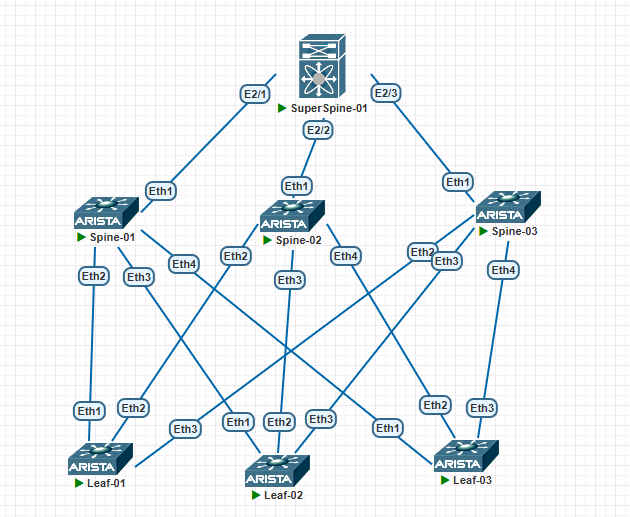

# Лабораторная работа №4. Underlay. BGP (Super-Spine + 3 Spine + 3 Leaf)

**Цель работы:** Настроить протокол BGP в Underlay-сети для обеспечения автоматической IP-связности между всеми сетевыми устройствами фабрики CLOS с использованием eBGP, BFD и MD5-аутентификации.

---

## 1. Топология сети



В среде **PNET Lab** собрана следующая архитектура:

- **Super-Spine (уровень 1):** 1 коммутатор **Cisco Nexus 5000** (образ NX-OS) — центральный маршрутизатор.
- **Spine (уровень 2):** 3 коммутатора **Arista vEOS** (Spine-01, Spine-02, Spine-03).
- **Leaf (уровень 3):** 3 коммутатора **Arista vEOS** (Leaf-01, Leaf-02, Leaf-03) — каждый подключён к каждому Spine (полносвязная топология).

### Схема подключений

| От (устройство) | К (устройство) | Интерфейс (от) | Интерфейс (к) |
|:---|:---|:---|:---|
| Super-Spine (Nexus 5000) | Spine-01 | E2/1 | Eth1 |
| Super-Spine (Nexus 5000) | Spine-02 | E2/2 | Eth1 |
| Super-Spine (Nexus 5000) | Spine-03 | E2/3 | Eth1 |
| Spine-01 | Leaf-01 | Eth2 | Eth1 |
| Spine-01 | Leaf-02 | Eth3 | Eth1 |
| Spine-01 | Leaf-03 | Eth4 | Eth1 |
| Spine-02 | Leaf-01 | Eth2 | Eth2 |
| Spine-02 | Leaf-02 | Eth3 | Eth2 |
| Spine-02 | Leaf-03 | Eth4 | Eth2 |
| Spine-03 | Leaf-01 | Eth2 | Eth3 |
| Spine-03 | Leaf-02 | Eth3 | Eth3 |
| Spine-03 | Leaf-03 | Eth4 | Eth3 |

> **Примечание:** Управляющие порты (Gi0/0, Gi0/1, Gi0/2) используются только для доступа к устройствам и не участвуют в Underlay-маршрутизации.

---

## 2. План работ

1. **Анализ топологии и планирование адресации.** Назначить Loopback и P2P-адреса для всех линков.
2. **Настройка базовых параметров L3.** Включить IP-адреса на интерфейсах, отключить L2-режим.
3. **Настройка BGP:**
   - Включить BGP на всех устройствах (`feature bgp` на Nexus 5000, `router bgp` на Arista).
   - Настроить eBGP-пиринг между Super-Spine и каждым Spine, а также между каждым Spine и каждым Leaf.
   - Использовать отдельные AS для каждого устройства (65000 – Super-Spine, 65001–65003 – Spine, 65004–65006 – Leaf).
4. **Настройка дополнительных механизмов:**
   - **BFD** с таймерами 50 мс для быстрого обнаружения отказов.
   - **MD5-аутентификация** для защиты BGP-сессий.
5. **Верификация.** Проверить установку BGP-соседств, BFD-сессий, маршруты в таблицах и связность между всеми Loopback-адресами.
6. **Документирование.** Зафиксировать все конфигурации и результаты проверки.

---

## 3. Адресное пространство Underlay

| Устройство | Роль | AS | Интерфейс | IP-адрес / Маска | Назначение |
|:---|:---|:---|:---|:---|:---|
| **Nexus 5000** | Super-Spine | 65000 | Loopback0 | 10.0.0.1/32 | Router ID |
| | | | E2/1 | 10.1.1.0/31 | к Spine-01 |
| | | | E2/2 | 10.1.1.2/31 | к Spine-02 |
| | | | E2/3 | 10.1.1.4/31 | к Spine-03 |
| **Spine-01** | Spine | 65001 | Loopback0 | 10.0.1.1/32 | Router ID |
| | | | Eth1 | 10.1.1.1/31 | к Super-Spine |
| | | | Eth2 | 10.1.2.0/31 | к Leaf-01 |
| | | | Eth3 | 10.1.2.2/31 | к Leaf-02 |
| | | | Eth4 | 10.1.2.4/31 | к Leaf-03 |
| **Spine-02** | Spine | 65002 | Loopback0 | 10.0.2.1/32 | Router ID |
| | | | Eth1 | 10.1.1.3/31 | к Super-Spine |
| | | | Eth2 | 10.1.2.6/31 | к Leaf-01 |
| | | | Eth3 | 10.1.2.8/31 | к Leaf-02 |
| | | | Eth4 | 10.1.2.10/31 | к Leaf-03 |
| **Spine-03** | Spine | 65003 | Loopback0 | 10.0.3.1/32 | Router ID |
| | | | Eth1 | 10.1.1.5/31 | к Super-Spine |
| | | | Eth2 | 10.1.2.12/31 | к Leaf-01 |
| | | | Eth3 | 10.1.2.14/31 | к Leaf-02 |
| | | | Eth4 | 10.1.2.16/31 | к Leaf-03 |
| **Leaf-01** | Leaf | 65004 | Loopback0 | 10.0.4.1/32 | Router ID |
| | | | Eth1 | 10.1.2.1/31 | к Spine-01 |
| | | | Eth2 | 10.1.2.7/31 | к Spine-02 |
| | | | Eth3 | 10.1.2.13/31 | к Spine-03 |
| **Leaf-02** | Leaf | 65005 | Loopback0 | 10.0.5.1/32 | Router ID |
| | | | Eth1 | 10.1.2.3/31 | к Spine-01 |
| | | | Eth2 | 10.1.2.9/31 | к Spine-02 |
| | | | Eth3 | 10.1.2.15/31 | к Spine-03 |
| **Leaf-03** | Leaf | 65006 | Loopback0 | 10.0.6.1/32 | Router ID |
| | | | Eth1 | 10.1.2.5/31 | к Spine-01 |
| | | | Eth2 | 10.1.2.11/31 | к Spine-02 |
| | | | Eth3 | 10.1.2.17/31 | к Spine-03 |

---

## 4. Конфигурации устройств

> **Важно:** Перед настройкой BGP на Cisco Nexus 5000 активируйте льготный период лицензирования:
> ```text
> switch# configure terminal
> switch(config)# license grace-period
> ```

### 4.1. Super-Spine (Cisco Nexus 5000)

```text
hostname NEXUS-5000
!
feature bfd
feature bgp
!
interface Ethernet2/1
  no switchport
  ip address 10.1.1.0/31
  bfd interval 50 min_rx 50 multiplier 3
  no shutdown
interface Ethernet2/2
  no switchport
  ip address 10.1.1.2/31
  bfd interval 50 min_rx 50 multiplier 3
  no shutdown
interface Ethernet2/3
  no switchport
  ip address 10.1.1.4/31
  bfd interval 50 min_rx 50 multiplier 3
  no shutdown
!
interface Loopback0
  ip address 10.0.0.1/32
!
router bgp 65000
  router-id 10.0.0.1
  address-family ipv4 unicast
    redistribute connected
  neighbor 10.1.1.1 remote-as 65001
    bfd
    password 0 MySecretKey123
    address-family ipv4 unicast
      disable-peer-as-check
  neighbor 10.1.1.3 remote-as 65002
    bfd
    password 0 MySecretKey123
    address-family ipv4 unicast
      disable-peer-as-check
  neighbor 10.1.1.5 remote-as 65003
    bfd
    password 0 MySecretKey123
    address-family ipv4 unicast
      disable-peer-as-check
4.2. Spine-01 (Arista vEOS, AS 65001)
text
hostname Spine-01
!
interface Ethernet1
  no switchport
  ip address 10.1.1.1/31
  bfd interval 50 min_rx 50 multiplier 3
  no shutdown
interface Ethernet2
  no switchport
  ip address 10.1.2.0/31
  bfd interval 50 min_rx 50 multiplier 3
  no shutdown
interface Ethernet3
  no switchport
  ip address 10.1.2.2/31
  bfd interval 50 min_rx 50 multiplier 3
  no shutdown
interface Ethernet4
  no switchport
  ip address 10.1.2.4/31
  bfd interval 50 min_rx 50 multiplier 3
  no shutdown
!
interface Loopback0
  ip address 10.0.1.1/32
!
router bgp 65001
  router-id 10.0.1.1
  address-family ipv4
    redistribute connected
  neighbor 10.1.1.0 remote-as 65000
    bfd
    password MySecretKey123
    address-family ipv4
  neighbor 10.1.2.1 remote-as 65004
    bfd
    password MySecretKey123
    address-family ipv4
  neighbor 10.1.2.3 remote-as 65005
    bfd
    password MySecretKey123
    address-family ipv4
  neighbor 10.1.2.5 remote-as 65006
    bfd
    password MySecretKey123
    address-family ipv4
4.3. Spine-02 (Arista vEOS, AS 65002)
text
hostname Spine-02
!
interface Ethernet1
  no switchport
  ip address 10.1.1.3/31
  bfd interval 50 min_rx 50 multiplier 3
  no shutdown
interface Ethernet2
  no switchport
  ip address 10.1.2.6/31
  bfd interval 50 min_rx 50 multiplier 3
  no shutdown
interface Ethernet3
  no switchport
  ip address 10.1.2.8/31
  bfd interval 50 min_rx 50 multiplier 3
  no shutdown
interface Ethernet4
  no switchport
  ip address 10.1.2.10/31
  bfd interval 50 min_rx 50 multiplier 3
  no shutdown
!
interface Loopback0
  ip address 10.0.2.1/32
!
router bgp 65002
  router-id 10.0.2.1
  address-family ipv4
    redistribute connected
  neighbor 10.1.1.2 remote-as 65000
    bfd
    password MySecretKey123
    address-family ipv4
  neighbor 10.1.2.7 remote-as 65004
    bfd
    password MySecretKey123
    address-family ipv4
  neighbor 10.1.2.9 remote-as 65005
    bfd
    password MySecretKey123
    address-family ipv4
  neighbor 10.1.2.11 remote-as 65006
    bfd
    password MySecretKey123
    address-family ipv4
4.4. Spine-03 (Arista vEOS, AS 65003)
text
hostname Spine-03
!
interface Ethernet1
  no switchport
  ip address 10.1.1.5/31
  bfd interval 50 min_rx 50 multiplier 3
  no shutdown
interface Ethernet2
  no switchport
  ip address 10.1.2.12/31
  bfd interval 50 min_rx 50 multiplier 3
  no shutdown
interface Ethernet3
  no switchport
  ip address 10.1.2.14/31
  bfd interval 50 min_rx 50 multiplier 3
  no shutdown
interface Ethernet4
  no switchport
  ip address 10.1.2.16/31
  bfd interval 50 min_rx 50 multiplier 3
  no shutdown
!
interface Loopback0
  ip address 10.0.3.1/32
!
router bgp 65003
  router-id 10.0.3.1
  address-family ipv4
    redistribute connected
  neighbor 10.1.1.4 remote-as 65000
    bfd
    password MySecretKey123
    address-family ipv4
  neighbor 10.1.2.13 remote-as 65004
    bfd
    password MySecretKey123
    address-family ipv4
  neighbor 10.1.2.15 remote-as 65005
    bfd
    password MySecretKey123
    address-family ipv4
  neighbor 10.1.2.17 remote-as 65006
    bfd
    password MySecretKey123
    address-family ipv4
4.5. Leaf-01 (Arista vEOS, AS 65004)
text
hostname Leaf-01
!
interface Ethernet1
  no switchport
  ip address 10.1.2.1/31
  bfd interval 50 min_rx 50 multiplier 3
  no shutdown
interface Ethernet2
  no switchport
  ip address 10.1.2.7/31
  bfd interval 50 min_rx 50 multiplier 3
  no shutdown
interface Ethernet3
  no switchport
  ip address 10.1.2.13/31
  bfd interval 50 min_rx 50 multiplier 3
  no shutdown
!
interface Loopback0
  ip address 10.0.4.1/32
!
router bgp 65004
  router-id 10.0.4.1
  address-family ipv4
    redistribute connected
  neighbor 10.1.2.0 remote-as 65001
    bfd
    password MySecretKey123
    address-family ipv4
  neighbor 10.1.2.6 remote-as 65002
    bfd
    password MySecretKey123
    address-family ipv4
  neighbor 10.1.2.12 remote-as 65003
    bfd
    password MySecretKey123
    address-family ipv4
4.6. Leaf-02 (Arista vEOS, AS 65005)
text
hostname Leaf-02
!
interface Ethernet1
  no switchport
  ip address 10.1.2.3/31
  bfd interval 50 min_rx 50 multiplier 3
  no shutdown
interface Ethernet2
  no switchport
  ip address 10.1.2.9/31
  bfd interval 50 min_rx 50 multiplier 3
  no shutdown
interface Ethernet3
  no switchport
  ip address 10.1.2.15/31
  bfd interval 50 min_rx 50 multiplier 3
  no shutdown
!
interface Loopback0
  ip address 10.0.5.1/32
!
router bgp 65005
  router-id 10.0.5.1
  address-family ipv4
    redistribute connected
  neighbor 10.1.2.2 remote-as 65001
    bfd
    password MySecretKey123
    address-family ipv4
  neighbor 10.1.2.8 remote-as 65002
    bfd
    password MySecretKey123
    address-family ipv4
  neighbor 10.1.2.14 remote-as 65003
    bfd
    password MySecretKey123
    address-family ipv4
4.7. Leaf-03 (Arista vEOS, AS 65006)
text
hostname Leaf-03
!
interface Ethernet1
  no switchport
  ip address 10.1.2.5/31
  bfd interval 50 min_rx 50 multiplier 3
  no shutdown
interface Ethernet2
  no switchport
  ip address 10.1.2.11/31
  bfd interval 50 min_rx 50 multiplier 3
  no shutdown
interface Ethernet3
  no switchport
  ip address 10.1.2.17/31
  bfd interval 50 min_rx 50 multiplier 3
  no shutdown
!
interface Loopback0
  ip address 10.0.6.1/32
!
router bgp 65006
  router-id 10.0.6.1
  address-family ipv4
    redistribute connected
  neighbor 10.1.2.4 remote-as 65001
    bfd
    password MySecretKey123
    address-family ipv4
  neighbor 10.1.2.10 remote-as 65002
    bfd
    password MySecretKey123
    address-family ipv4
  neighbor 10.1.2.16 remote-as 65003
    bfd
    password MySecretKey123
    address-family ipv4
Примечания по конфигурации
Пароль MD5 MySecretKey123 используется на всех BGP-сессиях – он должен быть одинаковым на обоих концах каждого пиринга.

На Nexus 5000 команда disable-peer-as-check позволяет Super-Spine передавать маршруты между разными Spine-коммутаторами (иначе eBGP не будет анонсировать маршруты с AS, отличным от своей). Это необходимо для связности между Leaf через Super-Spine.

BFD с таймерами 50 мс и множителем 3 даёт таймаут 150 мс.

5. Верификация
5.1. Проверка BGP-соседств
На Nexus 5000 (Super-Spine):

text
NEXUS-5000# show ip bgp summary
Neighbor        V    AS MsgRcvd MsgSent   TblVer  InQ OutQ Up/Down  State/PfxRcd
10.1.1.1        4 65001      25      25       25    0    0 00:12:30        6
10.1.1.3        4 65002      24      24       25    0    0 00:12:28        6
10.1.1.5        4 65003      26      26       25    0    0 00:12:35        6
Каждый Spine должен передать 3 префикса (Loopback-адреса Leaf) + свои собственные (Loopback и линки) – всего не менее 4–5 префиксов.

На Leaf-01:

text
Leaf-01# show ip bgp summary
Neighbor        V    AS MsgRcvd MsgSent   TblVer  InQ OutQ Up/Down  State/PfxRcd
10.1.2.0        4 65001      20      20       20    0    0 00:10:45        8
10.1.2.6        4 65002      19      19       20    0    0 00:10:40        8
10.1.2.12       4 65003      21      21       20    0    0 00:10:55        8
Leaf должен получить маршруты до всех остальных устройств (включая Super-Spine, другие Spine и другие Leaf).

5.2. Проверка BFD-сессий
На Nexus 5000:

text
NEXUS-5000# show bfd neighbors
OurAddr      NeighAddr    LD/RD         RH/RS     Holdown(mult)    State       Int
10.1.1.0     10.1.1.1     1090519041/0  Up        0(3)             Up          Eth2/1
10.1.1.2     10.1.1.3     1090519042/0  Up        0(3)             Up          Eth2/2
10.1.1.4     10.1.1.5     1090519043/0  Up        0(3)             Up          Eth2/3
На Spine-01:

text
Spine-01# show bfd neighbors
OurAddr      NeighAddr    State       Int
10.1.1.1     10.1.1.0     Up          Eth1
10.1.2.0     10.1.2.1     Up          Eth2
10.1.2.2     10.1.2.3     Up          Eth3
10.1.2.4     10.1.2.5     Up          Eth4
5.3. Проверка таблицы маршрутизации на Leaf-01
text
Leaf-01# show ip route bgp
B        10.0.0.1/32 [20/0] via 10.1.2.0, Ethernet1
B        10.0.1.1/32 [20/0] via 10.1.2.0, Ethernet1
B        10.0.2.1/32 [20/0] via 10.1.2.6, Ethernet2
B        10.0.3.1/32 [20/0] via 10.1.2.12, Ethernet3
B        10.0.5.1/32 [20/0] via 10.1.2.0, Ethernet1   (до Leaf-02 через Spine-01)
B        10.0.6.1/32 [20/0] via 10.1.2.0, Ethernet1   (до Leaf-03 через Spine-01)
5.4. Проверка связности между Leaf
С Leaf-01 на Leaf-02:

text
Leaf-01# ping 10.0.5.1 source 10.0.4.1
!!!!!
Success rate is 100 percent (5/5)
С Leaf-01 на Leaf-03:

text
Leaf-01# ping 10.0.6.1 source 10.0.4.1
!!!!!
Success rate is 100 percent (5/5)
6. Заключение
В ходе работы настроена Underlay-сеть фабрики CLOS на основе eBGP с использованием:

Super-Spine (Cisco Nexus 5000) и трёх Spine (Arista vEOS) + трёх Leaf (Arista vEOS).

BFD с таймерами 50 мс для быстрого обнаружения отказов.

MD5-аутентификации для защиты BGP-сессий.

Все BGP-соседства установлены, BFD-сессии активны, IP-связность между всеми устройствами обеспечена.
