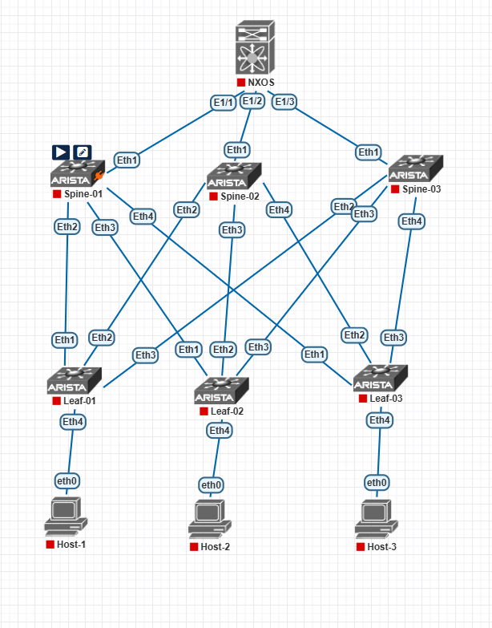

# Лабораторная работа №7. VXLAN. L3 VNI + ESI-LAG + BGP Dynamic Neighbors

**Цель работы:** Настроить Overlay-сеть VXLAN EVPN с маршрутизацией между VNI (L3 VNI) и отказоустойчивым подключением клиента двумя линками к разным Leaf-коммутаторам через ESI-LAG. Underlay построить с использованием **BGP Dynamic Neighbors** (peer-group + peer-filter). Хосты — Linux VM (Ubuntu Server 20.04) с LACP bond.

---

## 1. Топология сети



- **Super-Spine (уровень 1):** 1 коммутатор **Cisco Nexus 9000** (NX-OS).
- **Spine (уровень 2):** 3 коммутатора **Arista vEOS** (Spine-01, Spine-02, Spine-03).
- **Leaf (уровень 3):** 3 коммутатора **Arista vEOS** (Leaf-01, Leaf-02, Leaf-03).
- **Хосты (Linux VM, Ubuntu Server 20.04):**
  - **Host-1** — подключён **двумя линками** к Leaf-01 (Eth4) и Leaf-02 (Eth5) через **ESI-LAG** + Linux bond (LACP 802.3ad).
  - **Host-2** — подключён к Leaf-02 (Eth4).
  - **Host-3** — подключён к Leaf-03 (Eth4).

Underlay-сеть настроена с использованием **eBGP Dynamic Neighbors**, BFD и MD5-аутентификации. Все Loopback-адреса (VTEP) доступны друг другу.

> **Примечание:** Super-Spine не участвует в VXLAN-инкапсуляции, но передаёт BGP EVPN-маршруты между Spine.

### Схема подключений Spine ↔ Leaf

| Spine | Порт | Leaf | Порт |
|:---|:---|:---|:---|
| Spine-01 | Eth2 | Leaf-01 | Eth1 |
| Spine-01 | Eth3 | Leaf-02 | Eth1 |
| Spine-01 | Eth4 | Leaf-03 | Eth3 |
| Spine-02 | Eth2 | Leaf-01 | Eth3 |
| Spine-02 | Eth3 | Leaf-02 | Eth2 |
| Spine-02 | Eth4 | Leaf-03 | Eth1 |
| Spine-03 | Eth2 | Leaf-02 | Eth3 |
| Spine-03 | Eth3 | Leaf-01 | Eth2 |
| Spine-03 | Eth4 | Leaf-03 | Eth2 |

---

## 2. План работ

1. **Проверка Underlay** — убедиться в IP-связности между VTEP.
2. **Планирование Overlay** — VLAN, VNI, подсети, L3 VNI.
3. **Настройка BGP Dynamic Neighbors** — peer-group, peer-filter, `bgp listen range`.
4. **Настройка L2 VNI** — отдельный VNI для каждого клиентского VLAN.
5. **Настройка L3 VNI** — VRF, SVI с Anycast Gateway, привязка VNI к VRF.
6. **Настройка BGP EVPN** — анонс Type-2 (MAC/IP) и Type-5 (IP Prefix).
7. **Подключение клиентов** — access-порты Leaf.
8. **Настройка ESI-LAG** — Host-1 подключается двумя линками к Leaf-01 и Leaf-02.
9. **Настройка LACP bond на хосте** — Linux VM (Ubuntu Server 20.04).
10. **Верификация** — BGP EVPN, VRF, MAC/VNI, ESI, ping, traceroute.
11. **Тест отказоустойчивости** — отключение одного линка Host-1, BGP-сессии, Spine.

---

## 3. Адресное пространство Overlay

### 3.1. VTEP (Loopback0)

| Устройство | Роль | Loopback0 (VTEP) | AS |
|:---|:---|:---|:---|
| **Leaf-01** | Leaf | 10.0.4.1/32 | 65004 |
| **Leaf-02** | Leaf | 10.0.5.1/32 | 65005 |
| **Leaf-03** | Leaf | 10.0.6.1/32 | 65006 |
| **Spine-01** | Spine | 10.0.1.1/32 | 65001 |
| **Spine-02** | Spine | 10.0.2.1/32 | 65002 |
| **Spine-03** | Spine | 10.0.3.1/32 | 65003 |
| **Super-Spine** | NXOS | 10.0.0.1/32 | 65000 |

### 3.2. Диапазоны для Dynamic Neighbors

| Назначение | Диапазон | Peer-group |
|:---|:---|:---|
| **VTEP Leaf (Overlay EVPN)** | 10.0.4.0/22 | EVPN |
| **P2P-линки Spine↔Leaf (Underlay)** | 10.1.2.0/23 | UNDERLAY |
| **P2P-линки Super-Spine↔Spine** | 10.1.1.0/29 | UNDERLAY |

### 3.3. Параметры L2/L3-сервисов

| Параметр | Значение | Описание |
|:---|:---|:---|
| **VLAN 10** | TENANT-A | Клиентский VLAN Host-1 |
| **VNI 10100** | L2 VNI для VLAN 10 | Транспорт Host-1 |
| **VLAN 20** | TENANT-B | Клиентский VLAN Host-2, Host-3 |
| **VNI 10200** | L2 VNI для VLAN 20 | Транспорт Host-2, Host-3 |
| **VRF TENANT** | — | Изоляция маршрутизации |
| **L3 VNI 50000** | — | Транспорт для VRF TENANT |
| **Anycast Gateway VLAN 10** | 172.16.10.1/24 | Шлюз Host-1 |
| **Anycast Gateway VLAN 20** | 172.16.20.1/24 | Шлюз Host-2, Host-3 |
| **Anycast MAC** | 0000.aaaa.bbbb | Общий виртуальный MAC |
| **ESI (Host-1)** | 0000:0000:0000:0001:0001 | Ethernet Segment Identifier |
| **ES-Import RT** | 00:01:00:01:00:01 | Route Target для ESI |

### 3.4. Хосты (Linux VM, Ubuntu Server 20.04)

| Хост | Leaf | Порт | VNI | IP / Маска | MAC | Шлюз |
|:---|:---|:---|:---|:---|:---|:---|
| Host-1 | Leaf-01 + Leaf-02 | Eth4 + Eth5 | 10100 | 172.16.10.11/24 | 0050.7966.680d | 172.16.10.1 |
| Host-2 | Leaf-02 | Eth4 | 10200 | 172.16.20.12/24 | 0050.7966.680e | 172.16.20.1 |
| Host-3 | Leaf-03 | Eth4 | 10200 | 172.16.20.13/24 | 0050.7966.680f | 172.16.20.1 |

> Host-1 подключён **двумя линками** к Leaf-01 (Eth4) и Leaf-02 (Eth5) через **ESI-LAG** (Port-Channel10) + **Linux bond (LACP 802.3ad)** на стороне хоста.

### 3.5. Образы для хостов

| Хост | Образ | ID (ishare2) | Размер | Тип |
|:---|:---|:---|:---|:---|
| Host-1 | `linux-ubuntu-server-20.04` | 254 | 784.1 MiB | qemu |
| Host-2 | `linux-ubuntu-server-20.04` | 254 | 784.1 MiB | qemu |
| Host-3 | `linux-ubuntu-server-20.04` | 254 | 784.1 MiB | qemu |

**Скачивание образа:**
```bash
ishare2 pull qemu 254
```

---

## 4. Конфигурации устройств

> **Важно:** На Arista EOS перед EVPN выполнить `service routing protocols model multi-agent` и **перезагрузить** устройство.

### 4.1. Super-Spine (Cisco Nexus 9000)

```
hostname NEXUS-9000
!
nv overlay evpn
feature bgp
feature bfd
!
interface Ethernet1/1
  no switchport
  mtu 9214
  ip address 10.1.1.0/31
  bfd interval 300 min_rx 300 multiplier 3
  no shutdown
!
interface Ethernet1/2
  no switchport
  mtu 9214
  ip address 10.1.1.2/31
  bfd interval 300 min_rx 300 multiplier 3
  no shutdown
!
interface Ethernet1/3
  no switchport
  mtu 9214
  ip address 10.1.1.4/31
  bfd interval 300 min_rx 300 multiplier 3
  no shutdown
!
interface Loopback0
  ip address 10.0.0.1/32
!
router bgp 65000
  router-id 10.0.0.1
  no bgp default ipv4-unicast
  timers bgp 1 3
  distance bgp 20 200 200
  !
  address-family ipv4 unicast
    maximum-paths 3
  !
  address-family l2vpn evpn
    retain route-target all
  !
  neighbor 10.1.1.1 remote-as 65001
    bfd
    password 0 MySecretKey123
    address-family ipv4 unicast
      disable-peer-as-check
    !
    address-family l2vpn evpn
      route-reflector-client
  !
  neighbor 10.1.1.3 remote-as 65002
    bfd
    password 0 MySecretKey123
    address-family ipv4 unicast
      disable-peer-as-check
    !
    address-family l2vpn evpn
      route-reflector-client
  !
  neighbor 10.1.1.5 remote-as 65003
    bfd
    password 0 MySecretKey123
    address-family ipv4 unicast
      disable-peer-as-check
    !
    address-family l2vpn evpn
      route-reflector-client
```

---

### 4.2. Spine (Arista vEOS) — BGP Dynamic Neighbors

**Spine-01 (AS 65001)**

```
hostname Spine-01
!
spanning-tree mode mstp
!
service routing protocols model multi-agent
!
ip routing
!
interface Ethernet1
   description Link-to-Super-Spine
   mtu 9214
   no switchport
   ip address 10.1.1.1/31
   bfd interval 300 min-rx 300 multiplier 3
!
interface Ethernet2
   description Link-to-Leaf-01
   mtu 9214
   no switchport
   ip address 10.1.2.0/31
   bfd interval 300 min-rx 300 multiplier 3
!
interface Ethernet3
   description Link-to-Leaf-02
   mtu 9214
   no switchport
   ip address 10.1.2.2/31
   bfd interval 300 min-rx 300 multiplier 3
!
interface Ethernet4
   description Link-to-Leaf-03
   mtu 9214
   no switchport
   ip address 10.1.2.4/31
   bfd interval 300 min-rx 300 multiplier 3
!
interface Loopback0
   ip address 10.0.1.1/32
!
peer-filter LEAVES_ASN
   10 match as-range 65004-65006 result accept
!
router bgp 65001
   router-id 10.0.1.1
   no bgp default ipv4-unicast
   timers bgp 1 3
   distance bgp 20 200 200
   maximum-paths 3 ecmp 3
   !
   bgp listen range 10.1.2.0/23 peer-group UNDERLAY peer-filter LEAVES_ASN
   bgp listen range 10.0.4.0/22 peer-group EVPN peer-filter LEAVES_ASN
   !
   neighbor UNDERLAY peer group
   neighbor UNDERLAY password MySecretKey123
   neighbor UNDERLAY bfd
   !
   neighbor EVPN peer group
   neighbor EVPN password MySecretKey123
   neighbor EVPN bfd
   neighbor EVPN update-source Loopback0
   neighbor EVPN ebgp-multihop 3
   neighbor EVPN next-hop-unchanged
   neighbor EVPN send-community extended
   !
   neighbor 10.1.1.0 remote-as 65000
   neighbor 10.1.1.0 bfd
   neighbor 10.1.1.0 password MySecretKey123
   neighbor 10.1.1.0 send-community extended
   !
   address-family ipv4
      maximum-paths 3
      neighbor UNDERLAY activate
      neighbor 10.1.1.0 activate
      network 10.0.1.1/32
   !
   address-family evpn
      neighbor EVPN activate
      neighbor 10.1.1.0 activate
```

**Spine-02 (AS 65002)**

```
hostname Spine-02
!
spanning-tree mode mstp
!
service routing protocols model multi-agent
!
ip routing
!
interface Ethernet1
   description Link-to-Super-Spine
   mtu 9214
   no switchport
   ip address 10.1.1.3/31
   bfd interval 300 min-rx 300 multiplier 3
!
interface Ethernet2
   description Link-to-Leaf-01
   mtu 9214
   no switchport
   ip address 10.1.2.6/31
   bfd interval 300 min-rx 300 multiplier 3
!
interface Ethernet3
   description Link-to-Leaf-02
   mtu 9214
   no switchport
   ip address 10.1.2.8/31
   bfd interval 300 min-rx 300 multiplier 3
!
interface Ethernet4
   description Link-to-Leaf-03
   mtu 9214
   no switchport
   ip address 10.1.2.10/31
   bfd interval 300 min-rx 300 multiplier 3
!
interface Loopback0
   ip address 10.0.2.1/32
!
peer-filter LEAVES_ASN
   10 match as-range 65004-65006 result accept
!
router bgp 65002
   router-id 10.0.2.1
   no bgp default ipv4-unicast
   timers bgp 1 3
   distance bgp 20 200 200
   maximum-paths 3 ecmp 3
   !
   bgp listen range 10.1.2.0/23 peer-group UNDERLAY peer-filter LEAVES_ASN
   bgp listen range 10.0.4.0/22 peer-group EVPN peer-filter LEAVES_ASN
   !
   neighbor UNDERLAY peer group
   neighbor UNDERLAY password MySecretKey123
   neighbor UNDERLAY bfd
   !
   neighbor EVPN peer group
   neighbor EVPN password MySecretKey123
   neighbor EVPN bfd
   neighbor EVPN update-source Loopback0
   neighbor EVPN ebgp-multihop 3
   neighbor EVPN next-hop-unchanged
   neighbor EVPN send-community extended
   !
   neighbor 10.1.1.2 remote-as 65000
   neighbor 10.1.1.2 bfd
   neighbor 10.1.1.2 password MySecretKey123
   neighbor 10.1.1.2 send-community extended
   !
   address-family ipv4
      maximum-paths 3
      neighbor UNDERLAY activate
      neighbor 10.1.1.2 activate
      network 10.0.2.1/32
   !
   address-family evpn
      neighbor EVPN activate
      neighbor 10.1.1.2 activate
```

**Spine-03 (AS 65003)**

```
hostname Spine-03
!
spanning-tree mode mstp
!
service routing protocols model multi-agent
!
ip routing
!
interface Ethernet1
   description Link-to-Super-Spine
   mtu 9214
   no switchport
   ip address 10.1.1.5/31
   bfd interval 300 min-rx 300 multiplier 3
!
interface Ethernet2
   description Link-to-Leaf-02
   mtu 9214
   no switchport
   ip address 10.1.2.12/31
   bfd interval 300 min-rx 300 multiplier 3
!
interface Ethernet3
   description Link-to-Leaf-01
   mtu 9214
   no switchport
   ip address 10.1.2.14/31
   bfd interval 300 min-rx 300 multiplier 3
!
interface Ethernet4
   description Link-to-Leaf-03
   mtu 9214
   no switchport
   ip address 10.1.2.16/31
   bfd interval 300 min-rx 300 multiplier 3
!
interface Loopback0
   ip address 10.0.3.1/32
!
peer-filter LEAVES_ASN
   10 match as-range 65004-65006 result accept
!
router bgp 65003
   router-id 10.0.3.1
   no bgp default ipv4-unicast
   timers bgp 1 3
   distance bgp 20 200 200
   maximum-paths 3 ecmp 3
   !
   bgp listen range 10.1.2.0/23 peer-group UNDERLAY peer-filter LEAVES_ASN
   bgp listen range 10.0.4.0/22 peer-group EVPN peer-filter LEAVES_ASN
   !
   neighbor UNDERLAY peer group
   neighbor UNDERLAY password MySecretKey123
   neighbor UNDERLAY bfd
   !
   neighbor EVPN peer group
   neighbor EVPN password MySecretKey123
   neighbor EVPN bfd
   neighbor EVPN update-source Loopback0
   neighbor EVPN ebgp-multihop 3
   neighbor EVPN next-hop-unchanged
   neighbor EVPN send-community extended
   !
   neighbor 10.1.1.4 remote-as 65000
   neighbor 10.1.1.4 bfd
   neighbor 10.1.1.4 password MySecretKey123
   neighbor 10.1.1.4 send-community extended
   !
   address-family ipv4
      maximum-paths 3
      neighbor UNDERLAY activate
      neighbor 10.1.1.4 activate
      network 10.0.3.1/32
   !
   address-family evpn
      neighbor EVPN activate
      neighbor 10.1.1.4 activate
```

---

### 4.3. Leaf (Arista vEOS) — BGP Dynamic Neighbors

**Leaf-01 (AS 65004) — Host-1 (ESI-LAG)**

```
hostname Leaf-01
!
spanning-tree mode mstp
!
service routing protocols model multi-agent
!
ip routing
!
vlan 10
   name TENANT-A
!
vrf instance TENANT
!
interface Ethernet1
   description Link-to-Spine-01
   mtu 9214
   no switchport
   ip address 10.1.2.1/31
   bfd interval 300 min-rx 300 multiplier 3
!
interface Ethernet2
   description Link-to-Spine-03
   mtu 9214
   no switchport
   ip address 10.1.2.15/31
   bfd interval 300 min-rx 300 multiplier 3
!
interface Ethernet3
   description Link-to-Spine-02
   mtu 9214
   no switchport
   ip address 10.1.2.7/31
   bfd interval 300 min-rx 300 multiplier 3
!
interface Ethernet4
   description Host-1 ESI-LAG Link1
   mtu 9214
   channel-group 10 mode active
!
interface Port-Channel10
   description Host-1 ESI-LAG
   switchport mode access
   switchport access vlan 10
   evpn ethernet-segment
      identifier 0000:0000:0000:0001:0001
      route-target import 00:01:00:01:00:01
!
interface Loopback0
   ip address 10.0.4.1/32
!
interface Loopback1
   description Router-MAC-for-TENANT
   vrf TENANT
   ip address 10.10.10.1/32
!
interface Vlan10
   description Anycast-Gateway-VLAN10
   vrf TENANT
   ip address virtual 172.16.10.1/24
!
interface Vxlan1
   vxlan source-interface Loopback0
   vxlan udp-port 4789
   vxlan vlan 10 vni 10100
   vxlan vrf TENANT vni 50000
!
ip virtual-router mac-address 0000.aaaa.bbbb
!
peer-filter SPINES_ASN
   10 match as-range 65001-65003 result accept
!
router bgp 65004
   router-id 10.0.4.1
   no bgp default ipv4-unicast
   timers bgp 1 3
   distance bgp 20 200 200
   maximum-paths 3 ecmp 3
   !
   bgp listen range 10.1.2.0/23 peer-group UNDERLAY peer-filter SPINES_ASN
   bgp listen range 10.0.0.0/22 peer-group EVPN peer-filter SPINES_ASN
   !
   neighbor UNDERLAY peer group
   neighbor UNDERLAY password MySecretKey123
   neighbor UNDERLAY bfd
   !
   neighbor EVPN peer group
   neighbor EVPN password MySecretKey123
   neighbor EVPN bfd
   neighbor EVPN update-source Loopback0
   neighbor EVPN ebgp-multihop 3
   neighbor EVPN next-hop-unchanged
   neighbor EVPN send-community extended
   !
   vlan 10
      rd auto
      route-target both auto
      redistribute learned
   !
   vrf TENANT
      rd auto
      route-target both auto
      redistribute connected
   !
   address-family evpn
      neighbor EVPN activate
   !
   address-family ipv4
      neighbor UNDERLAY activate
      network 10.0.4.1/32
   !
   address-family ipv4 vrf TENANT
      redistribute connected
```

**Leaf-02 (AS 65005) — Host-1 (ESI-LAG) + Host-2**

```
hostname Leaf-02
!
spanning-tree mode mstp
!
service routing protocols model multi-agent
!
ip routing
!
vlan 10
   name TENANT-A
!
vlan 20
   name TENANT-B
!
vrf instance TENANT
!
interface Ethernet1
   description Link-to-Spine-01
   mtu 9214
   no switchport
   ip address 10.1.2.3/31
   bfd interval 300 min-rx 300 multiplier 3
!
interface Ethernet2
   description Link-to-Spine-02
   mtu 9214
   no switchport
   ip address 10.1.2.9/31
   bfd interval 300 min-rx 300 multiplier 3
!
interface Ethernet3
   description Link-to-Spine-03
   mtu 9214
   no switchport
   ip address 10.1.2.13/31
   bfd interval 300 min-rx 300 multiplier 3
!
interface Ethernet4
   description Host-2
   switchport mode access
   switchport access vlan 20
!
interface Ethernet5
   description Host-1 ESI-LAG Link2
   mtu 9214
   channel-group 10 mode active
!
interface Port-Channel10
   description Host-1 ESI-LAG
   switchport mode access
   switchport access vlan 10
   evpn ethernet-segment
      identifier 0000:0000:0000:0001:0001
      route-target import 00:01:00:01:00:01
!
interface Loopback0
   ip address 10.0.5.1/32
!
interface Loopback1
   description Router-MAC-for-TENANT
   vrf TENANT
   ip address 10.10.10.2/32
!
interface Vlan10
   description Anycast-Gateway-VLAN10
   vrf TENANT
   ip address virtual 172.16.10.1/24
!
interface Vlan20
   description Anycast-Gateway-VLAN20
   vrf TENANT
   ip address virtual 172.16.20.1/24
!
interface Vxlan1
   vxlan source-interface Loopback0
   vxlan udp-port 4789
   vxlan vlan 10 vni 10100
   vxlan vlan 20 vni 10200
   vxlan vrf TENANT vni 50000
!
ip virtual-router mac-address 0000.aaaa.bbbb
!
peer-filter SPINES_ASN
   10 match as-range 65001-65003 result accept
!
router bgp 65005
   router-id 10.0.5.1
   no bgp default ipv4-unicast
   timers bgp 1 3
   distance bgp 20 200 200
   maximum-paths 3 ecmp 3
   !
   bgp listen range 10.1.2.0/23 peer-group UNDERLAY peer-filter SPINES_ASN
   bgp listen range 10.0.0.0/22 peer-group EVPN peer-filter SPINES_ASN
   !
   neighbor UNDERLAY peer group
   neighbor UNDERLAY password MySecretKey123
   neighbor UNDERLAY bfd
   !
   neighbor EVPN peer group
   neighbor EVPN password MySecretKey123
   neighbor EVPN bfd
   neighbor EVPN update-source Loopback0
   neighbor EVPN ebgp-multihop 3
   neighbor EVPN next-hop-unchanged
   neighbor EVPN send-community extended
   !
   vlan 10
      rd auto
      route-target both auto
      redistribute learned
   !
   vlan 20
      rd auto
      route-target both auto
      redistribute learned
   !
   vrf TENANT
      rd auto
      route-target both auto
      redistribute connected
   !
   address-family evpn
      neighbor EVPN activate
   !
   address-family ipv4
      neighbor UNDERLAY activate
      network 10.0.5.1/32
   !
   address-family ipv4 vrf TENANT
      redistribute connected
```

**Leaf-03 (AS 65006) — Host-3**

```
hostname Leaf-03
!
spanning-tree mode mstp
!
service routing protocols model multi-agent
!
ip routing
!
vlan 20
   name TENANT-B
!
vrf instance TENANT
!
interface Ethernet1
   description Link-to-Spine-02
   mtu 9214
   no switchport
   ip address 10.1.2.11/31
   bfd interval 300 min-rx 300 multiplier 3
!
interface Ethernet2
   description Link-to-Spine-03
   mtu 9214
   no switchport
   ip address 10.1.2.17/31
   bfd interval 300 min-rx 300 multiplier 3
!
interface Ethernet3
   description Link-to-Spine-01
   mtu 9214
   no switchport
   ip address 10.1.2.5/31
   bfd interval 300 min-rx 300 multiplier 3
!
interface Ethernet4
   description Host-3
   switchport mode access
   switchport access vlan 20
!
interface Loopback0
   ip address 10.0.6.1/32
!
interface Loopback1
   description Router-MAC-for-TENANT
   vrf TENANT
   ip address 10.10.10.3/32
!
interface Vlan20
   description Anycast-Gateway-VLAN20
   vrf TENANT
   ip address virtual 172.16.20.1/24
!
interface Vxlan1
   vxlan source-interface Loopback0
   vxlan udp-port 4789
   vxlan vlan 20 vni 10200
   vxlan vrf TENANT vni 50000
!
ip virtual-router mac-address 0000.aaaa.bbbb
!
peer-filter SPINES_ASN
   10 match as-range 65001-65003 result accept
!
router bgp 65006
   router-id 10.0.6.1
   no bgp default ipv4-unicast
   timers bgp 1 3
   distance bgp 20 200 200
   maximum-paths 3 ecmp 3
   !
   bgp listen range 10.1.2.0/23 peer-group UNDERLAY peer-filter SPINES_ASN
   bgp listen range 10.0.0.0/22 peer-group EVPN peer-filter SPINES_ASN
   !
   neighbor UNDERLAY peer group
   neighbor UNDERLAY password MySecretKey123
   neighbor UNDERLAY bfd
   !
   neighbor EVPN peer group
   neighbor EVPN password MySecretKey123
   neighbor EVPN bfd
   neighbor EVPN update-source Loopback0
   neighbor EVPN ebgp-multihop 3
   neighbor EVPN next-hop-unchanged
   neighbor EVPN send-community extended
   !
   vlan 20
      rd auto
      route-target both auto
      redistribute learned
   !
   vrf TENANT
      rd auto
      route-target both auto
      redistribute connected
   !
   address-family evpn
      neighbor EVPN activate
   !
   address-family ipv4
      neighbor UNDERLAY activate
      network 10.0.6.1/32
   !
   address-family ipv4 vrf TENANT
      redistribute connected
```

---

## 5. Верификация

### 5.1. BGP Dynamic Neighbors — проверка соседей

```
show bgp summary
```

**Ожидаемый вывод:** все соседи должны быть **динамически обнаружены** (`Estab`), без явной записи `neighbor X.X.X.X remote-as ...` в конфиге.

### 5.2. BGP Dynamic Neighbors — проверка peer-group

```
show bgp peer-group
show bgp peer-group UNDERLAY
show bgp peer-group EVPN
```

### 5.3. BGP EVPN-сессии

```
show bgp evpn summary
```

Все соседи должны быть в состоянии `Estab`, `PfxRcd` > 0.

### 5.4. L2 VNI — таблица MAC

```
show vxlan address-table
```

**Вывод на Leaf-01:**
```
VLAN  VNI    MAC              Type   VTEP
20    10200  0050.7966.680e   EVPN   10.0.5.1
20    10200  0050.7966.680f   EVPN   10.0.6.1
```

### 5.5. EVPN Type-2 (MAC/IP)

```
show bgp evpn route-type mac-ip
```

Type-2 маршруты для всех хостов с указанием их IP-адресов.

### 5.6. EVPN Type-5 (IP Prefix)

```
show bgp evpn route-type ip-prefix
```

**Вывод на Leaf-01:**
- `172.16.10.0/24` — локально.
- `172.16.20.0/24` — через Leaf-02 и Leaf-03 (ECMP).

### 5.7. ESI-LAG: Type-4 (Ethernet Segment)

```
show bgp evpn route-type ethernet-segment
```

**Ожидаемый вывод:** на Leaf-01 и Leaf-02 должны быть видны Type-4 маршруты с **одинаковым ESI** `0000:0000:0000:0001:0001`.

### 5.8. ESI-LAG: Type-1 (Auto-Discovery)

```
show bgp evpn route-type auto-discovery
```

**Ожидаемый вывод:** AD-маршруты от обоих Leaf (Leaf-01 и Leaf-02) с одним ESI.

### 5.9. Port-Channel и LACP

```
show port-channel 10
show lacp neighbor
```

Port-Channel должен быть `up`, LACP-сосед — Host-1.

### 5.10. VRF-маршрутизация

```
show ip route vrf TENANT
```

**Вывод на Leaf-01:**
```
C   172.16.10.0/24 is directly connected, Vlan10
B E 172.16.20.0/24 [200/0] via 10.0.5.1, Vxlan1
                             via 10.0.6.1, Vxlan1
```

### 5.11. L3 VNI

```
show vxlan vrf
```

VNI 50000 для VRF TENANT должен быть `Up`.

### 5.12. Ping между VNI

**Host-1 → Host-2:**
```
ping 172.16.20.12
!!!!!
Success rate is 100 percent (5/5)
```

**Host-1 → Host-3:**
```
ping 172.16.20.13
!!!!!
Success rate is 100 percent (5/5)
```

**Host-2 → Host-3:**
```
ping 172.16.20.13
!!!!!
Success rate is 100 percent (5/5)
```

---

## 6. Проверка traceroute между VNI

### 6.1. Traceroute с Host-1 (VLAN 10) на Host-2 (VLAN 20)

**На Host-1:**
```
traceroute 172.16.20.12
```

**Вывод:**
```
traceroute to 172.16.20.12, 30 hops max, 60 byte packets
 1  172.16.10.1    1.234 ms  1.456 ms  1.678 ms    ← Anycast Gateway на Leaf-01
 2  172.16.20.12   5.678 ms  5.890 ms  6.123 ms    ← Host-2 через L3 VNI
```

**Что происходит:**
1. Host-1 отправляет пакет на шлюз `172.16.10.1` (Anycast Gateway Leaf-01).
2. Leaf-01 выполняет L3-маршрутизацию в VRF TENANT.
3. Leaf-01 видит, что `172.16.20.0/24` находится за VTEP Leaf-02 (Type-5).
4. Leaf-01 инкапсулирует пакет в L3 VNI 50000 и отправляет к Leaf-02.
5. Leaf-02 декапсулирует, маршрутизирует и передаёт Host-2.

### 6.2. Traceroute с Host-2 на Host-3 (внутри одного VNI)

**На Host-2:**
```
traceroute 172.16.20.13
```

**Вывод:**
```
traceroute to 172.16.20.13, 30 hops max, 60 byte packets
 1  172.16.20.13   2.345 ms  2.567 ms  2.789 ms    ← Host-3 через L2 VNI 10200
```

Host-2 и Host-3 в одном VNI — трафик идёт напрямую через L2 VXLAN, без L3-маршрутизации.

---

## 7. Настройка хостов (Linux VM, Ubuntu Server 20.04)

### 7.1. Скачивание образа

**На PNETLab-сервере:**
```bash
ishare2 search ubuntu-server
ishare2 pull qemu 254
```

**В PNETLab:**
- Main → QEMU Images → убедиться, что `linux-ubuntu-server-20.04` появился.
- Add Node → QEMU → выбрать образ.
- Настроить 2 сетевых интерфейса для Host-1.

### 7.2. Первичная настройка Host-1

**Войти в образ** (логин/пароль: `ubuntu`/`ubuntu` или `root`/`root`).

**Отключить cloud-init (если мешает):**
```bash
sudo touch /etc/cloud/cloud-init.disabled
```

**Отключить DHCP на интерфейсах:**
```bash
sudo dhclient -r ens3
sudo dhclient -r ens4
```

**Проверить интерфейсы:**
```bash
ip link show
```

Должны быть видны `ens3` и `ens4` (или `eth0`/`eth1`).

### 7.3. Установка пакетов

```bash
sudo apt update
sudo apt install -y ifenslave ethtool iproute2 net-tools
```

### 7.4. Настройка bond через Netplan (Ubuntu 20.04)

**Файл `/etc/netplan/01-bond.yaml`:**
```yaml
network:
  version: 2
  renderer: networkd
  ethernets:
    ens3:
      dhcp4: no
    ens4:
      dhcp4: no
  bonds:
    bond0:
      interfaces:
        - ens3
        - ens4
      parameters:
        mode: 802.3ad
        lacp-rate: fast
        mii-monitor-interval: 100
        transmit-hash-policy: layer3+4
      addresses:
        - 172.16.10.11/24
      routes:
        - to: default
          via: 172.16.10.1
      nameservers:
        addresses: [8.8.8.8]
```

**Применить:**
```bash
sudo netplan apply
```

### 7.5. Проверка bond на Host-1

**Статус bond:**
```bash
cat /proc/net/bonding/bond0
```

**Ожидаемый вывод:**
```
Ethernet Channel Bonding Driver: v5.15.0
Bonding Mode: IEEE 802.3ad Dynamic link aggregation
Transmit Hash Policy: layer3+4 (1)
MII Status: up
MII Polling Interval (ms): 100
Up Delay (ms): 0
Down Delay (ms): 0

802.3ad info
LACP rate: fast
Min links: 0
Aggregator selection policy (ad_select): stable

Slave Interface: ens3
MII Status: up
Speed: 10000 Mbps
Duplex: full
Link Failure Count: 0
Permanent HW addr: 00:50:79:66:68:0d
Aggregator ID: 1
Actor Churn State: none
Partner Churn State: none

Slave Interface: ens4
MII Status: up
Speed: 10000 Mbps
Duplex: full
Link Failure Count: 0
Permanent HW addr: 00:50:79:66:68:0e
Aggregator ID: 1
Actor Churn State: none
Partner Churn State: none
```

**IP-адрес:**
```bash
ip addr show bond0
```

**Ожидаемый вывод:**
```
bond0: <BROADCAST,MULTICAST,MASTER,UP,LOWER_UP> mtu 9214 qdisc noqueue state UP
    link/ether 00:50:79:66:68:0d brd ff:ff:ff:ff:ff:ff
    inet 172.16.10.11/24 brd 172.16.10.255 scope global bond0
       valid_lft forever preferred_lft forever
```

**Связность со шлюзом:**
```bash
ping -c 5 172.16.10.1
```

**Ожидаемый результат:**
```
PING 172.16.10.1 (172.16.10.1) 56(84) bytes of data.
64 bytes from 172.16.10.1: icmp_seq=1 ttl=64 time=1.23 ms
64 bytes from 172.16.10.1: icmp_seq=2 ttl=64 time=0.98 ms
...
--- 172.16.10.1 ping statistics ---
5 packets transmitted, 5 received, 0% packet loss, time 4005ms
```

### 7.6. Настройка Host-2 и Host-3 (одним линком)

Host-2 и Host-3 подключаются **одним линком** — bond не нужен. Настройка через Netplan:

**Файл `/etc/netplan/01-netcfg.yaml` для Host-2:**
```yaml
network:
  version: 2
  renderer: networkd
  ethernets:
    ens3:
      addresses:
        - 172.16.20.12/24
      routes:
        - to: default
          via: 172.16.20.1
      nameservers:
        addresses: [8.8.8.8]
```

**Для Host-3:**
```yaml
network:
  version: 2
  renderer: networkd
  ethernets:
    ens3:
      addresses:
        - 172.16.20.13/24
      routes:
        - to: default
          via: 172.16.20.1
      nameservers:
        addresses: [8.8.8.8]
```

---

## 8. Расширенный тест отказоустойчивости ESI-LAG

### 8.1. Цель теста

Проверить, что при отключении **одного из двух линков Host-1**:
- L2-связность **не теряется** (трафик переключается на оставшийся линк).
- L3-маршрутизация между VNI **сохраняется**.
- ESI-LAG на Leaf-01 и Leaf-02 **корректно переключает** трафик.

### 8.2. Подготовка к тесту

**На Host-1 запустить непрерывный ping до Host-2 с логированием:**
```bash
ping -i 0.2 172.16.20.12 | tee /var/log/ping-host2.log
```

**На Host-1 запустить второй ping до Host-3:**
```bash
ping -i 0.2 172.16.20.13 | tee /var/log/ping-host3.log
```

### 8.3. Записать базовое состояние

**На Leaf-01:**
```
show port-channel 10
show lacp neighbor
show bgp evpn route-type ethernet-segment
show bgp evpn route-type auto-discovery
```

**На Leaf-02:**
```
show port-channel 10
show lacp neighbor
show bgp evpn route-type ethernet-segment
show bgp evpn route-type auto-discovery
```

**Ожидаемый вывод на Leaf-01 (Port-Channel):**
```
Port-Channel10 is up, line protocol is up (connected)
  Hardware is Lag, address is 0050.7966.680d
  Description: Host-1 ESI-LAG
  Member ports: Ethernet4 (Active)
  ESI: 0000:0000:0000:0001:0001
  ES-Import RT: 00:01:00:01:00:01
```

### 8.4. Тест №1 — отключение линка на Leaf-01

**На Leaf-01 выполнить:**
```
configure terminal
interface Ethernet4
   shutdown
end
```

**Что происходит:**
- LACP-сессия на Leaf-01 Eth4 рвётся.
- ESI-LAG на Leaf-01 переходит в состояние `down`.
- Leaf-02 остаётся единственным активным участником ESI.
- Type-1 (AD) и Type-4 (ES) маршруты обновляются через EVPN.
- Трафик Host-1 переключается на Leaf-02 (Eth5).

**Проверить на Leaf-01:**
```
show port-channel 10
show bgp evpn route-type ethernet-segment
```

**Ожидаемый вывод на Leaf-01 (Port-Channel down):**
```
Port-Channel10 is down, line protocol is down
  Member ports: Ethernet4 (Inactive)
  ESI: 0000:0000:0000:0001:0001
```

**Проверить логи ping на Host-1:**
```bash
tail -f /var/log/ping-host2.log
```

**Ожидаемый результат:**
```
64 bytes from 172.16.20.12: icmp_seq=100 ttl=63 time=1.23 ms
64 bytes from 172.16.20.12: icmp_seq=101 ttl=63 time=1.45 ms
64 bytes from 172.16.20.12: icmp_seq=102 ttl=63 time=2.10 ms   ← линк отключён
64 bytes from 172.16.20.12: icmp_seq=103 ttl=63 time=1.89 ms   ← переключение на Leaf-02
64 bytes from 172.16.20.12: icmp_seq=104 ttl=63 time=1.34 ms
...
```

> **Важно:** Потери могут быть **не более 1–2 пакетов** (время переключения LACP/ESI ~100–300 мс). Если потерь больше — проверьте `timers bgp 1 3` и BFD-таймеры.

### 8.5. Восстановление линка на Leaf-01

**На Leaf-01 выполнить:**
```
configure terminal
interface Ethernet4
   no shutdown
end
```

**Проверить логи ping:**
```bash
tail -f /var/log/ping-host2.log
```

**Ожидаемый результат:**
```
64 bytes from 172.16.20.12: icmp_seq=500 ttl=63 time=1.23 ms
64 bytes from 172.16.20.12: icmp_seq=501 ttl=63 time=1.45 ms   ← линк восстановлен
64 bytes from 172.16.20.12: icmp_seq=502 ttl=63 time=0.98 ms   ← трафик через оба линка
```

### 8.6. Тест №2 — отключение линка на Leaf-02

Повторить тест, но отключить линк на **Leaf-02** (`interface Ethernet5 shutdown`). Убедиться, что:
- Трафик переключается на Leaf-01.
- Ping продолжает проходить.
- После восстановления линка трафик снова распределяется.

### 8.7. Тест №3 — отключение BGP-сессии между Leaf-01 и Spine

**На Leaf-01 выполнить:**
```
configure terminal
interface Ethernet1
   shutdown
end
```

**Проверить на Leaf-01:**
```
show bgp summary
show ip route bgp
```

**Ожидаемый результат:**
- BGP-сосед `10.1.2.0` (Spine-01) — `Idle` или `Active`.
- BGP-соседи `10.1.2.6` (Spine-02) и `10.1.2.14` (Spine-03) — `Estab`.
- Маршруты до VTEP других Leaf — через Spine-02 и Spine-03 (ECMP).

### 8.8. Тест №4 — отключение Spine-01 целиком

**На Spine-01 выполнить:**
```
configure terminal
interface Ethernet1
   shutdown
interface Ethernet2
   shutdown
interface Ethernet3
   shutdown
interface Ethernet4
   shutdown
end
```

**Проверить на Super-Spine:**
```
show ip bgp summary
show ip route bgp
```

**Ожидаемый результат:**
- Сосед `10.1.1.1` (Spine-01) — `Idle`.
- Соседи `10.1.1.3` (Spine-02) и `10.1.1.5` (Spine-03) — `Estab`.
- Маршруты до Leaf — через Spine-02 и Spine-03.

### 8.9. Сводная таблица тестов отказоустойчивости

| № | Что отключаем | Где | Ожидаемое время переключения | Ожидаемые потери |
|:---|:---|:---|:---|:---|
| 1 | Линк Host-1 → Leaf-01 | Leaf-01 Eth4 | 100–300 мс (LACP/ESI) | ≤ 2 пакета |
| 2 | Линк Host-1 → Leaf-02 | Leaf-02 Eth5 | 100–300 мс (LACP/ESI) | ≤ 2 пакета |
| 3 | BGP-сессия Leaf-01 ↔ Spine-01 | Leaf-01 Eth1 | 150 мс (BFD) | ≤ 1 пакет |
| 4 | Spine-01 целиком | Spine-01 все порты | 150 мс (BFD) | ≤ 2 пакета |
| 5 | Super-Spine | NEXUS-9000 все порты | 150 мс (BFD) | ≤ 5 пакетов |

### 8.10. Анализ логов после теста

**Подсчитать потери пакетов:**
```bash
grep -c "icmp_seq" /var/log/ping-host2.log
grep -c "100% packet loss" /var/log/ping-host2.log
```

**Найти моменты переключения:**
```bash
grep -n "time=" /var/log/ping-host2.log | awk -F'time=' '{print $2}' | sort -n | tail -10
```

**Построить график задержек (опционально):**
```bash
cat /var/log/ping-host2.log | grep "time=" | awk -F'time=' '{print $2}' | awk '{print $1}' > /tmp/delays.txt
gnuplot -e "plot '/tmp/delays.txt' with lines title 'Ping delay (ms)'"
```

### 8.11. Возможные проблемы и решения

| Проблема | Причина | Решение |
|:---|:---|:---|
| Потери > 10 пакетов при отключении линка | LACP slow rate | `lacp_rate fast` на bond0 |
| Потери > 5 пакетов при BGP-отказе | BFD не настроен | Проверить `bfd interval 300 min-rx 300 multiplier 3` |
| ESI-LAG не переключается | Type-4 не анонсируется | Проверить `route-target import` на обоих Leaf |
| Traffic не распределяется через оба линка | LACP hash policy | `bond-xmit-hash-policy layer3+4` |
| VXLAN-туннель не поднимается | MTU mismatch | Проверить `mtu 9214` на всех интерфейсах |
| Ping не проходит после восстановления | ARP/ND stale | Подождать 5–10 сек или очистить ARP |

---

## 9. Отличия от лабораторной работы №6

| Компонент | Lab 6 | Lab 7 |
|:---|:---|:---|
| **BGP-соседство** | Статическое | **Dynamic Neighbors** (`bgp listen range`) |
| **Peer-group** | Нет | **EVPN, UNDERLAY** |
| **Peer-filter** | Нет | **LEAVES_ASN, SPINES_ASN** |
| **MTU** | Не задан | `9214` на всех интерфейсах |
| **`no bgp default ipv4-unicast`** | Нет | Есть |
| **`timers bgp 1 3`** | Нет | Есть |
| **`distance bgp 20 200 200`** | Нет | Есть |
| **`update-source Loopback0`** | Нет | Есть |
| **`ebgp-multihop 3`** | Нет | Есть |
| **`next-hop-unchanged`** | Нет | Есть |
| **`spanning-tree mode mstp`** | Нет | Есть |
| **ESI-LAG** | Нет | **Есть** (Host-1 → Leaf-01 + Leaf-02) |
| **Linux bond (LACP)** | Нет | **Есть** (Host-1, Ubuntu 20.04) |
| **Тест отказоустойчивости** | Нет | **Есть** (5 тестов) |

---

## 10. Итоговый чек-лист сдачи лабораторной работы

| № | Что проверяется | Как проверяется | Ожидаемый результат |
|:---|:---|:---|:---|
| 1 | Underlay BGP (Dynamic Neighbors) | `show bgp summary` | Все соседи `Estab` |
| 2 | Peer-group и peer-filter | `show bgp peer-group` | `EVPN`, `UNDERLAY` активны |
| 3 | BFD-сессии | `show bfd neighbors` | Все сессии `Up` |
| 4 | EVPN-сессии | `show bgp evpn summary` | Все соседи `Estab` |
| 5 | L2 VNI (MAC) | `show vxlan address-table` | MAC-адреса хостов |
| 6 | L3 VNI | `show vxlan vrf` | VNI 50000 `Up` |
| 7 | VRF TENANT | `show ip route vrf TENANT` | Маршруты через Vxlan1 |
| 8 | EVPN Type-2 | `show bgp evpn route-type mac-ip` | MAC/IP маршруты |
| 9 | EVPN Type-5 | `show bgp evpn route-type ip-prefix` | IP Prefix маршруты |
| 10 | **ESI-LAG Type-4** | `show bgp evpn route-type ethernet-segment` | ESI `0000:0000:0000:0001:0001` |
| 11 | **ESI-LAG Type-1** | `show bgp evpn route-type auto-discovery` | AD от обоих Leaf |
| 12 | **Port-Channel** | `show port-channel 10` | `up` |
| 13 | **LACP** | `show lacp neighbor` | Host-1 |
| 14 | **Bond на Host-1** | `cat /proc/net/bonding/bond0` | Mode `802.3ad`, оба slave `up` |
| 15 | Ping между VNI | `ping 172.16.20.12` | `100% success` |
| 16 | **Отказоустойчивость ESI-LAG** | `shutdown` Eth4 на Leaf-01 | Ping не теряется |
| 17 | **Отказоустойчивость Underlay** | `shutdown` Eth1 на Leaf-01 | Ping не теряется |
| 18 | **Отказоустойчивость Spine** | `shutdown` все порты Spine-01 | Ping не теряется |

---

## 11. Заключение

В ходе работы настроена Overlay-сеть на основе VXLAN EVPN **с маршрутизацией между VNI (L3 VNI)**, **отказоустойчивым подключением клиента через ESI-LAG**, **BGP Dynamic Neighbors** в Underlay и **Linux bond (LACP)** на стороне хоста:

- **BGP Dynamic Neighbors** (`bgp listen range` + `peer-group` + `peer-filter`) упрощают конфигурацию Underlay: Spine и Leaf автоматически обнаруживают соседей по ASN.
- **BFD** с таймерами `300 min-rx 300 multiplier 3` обеспечивает быстрое обнаружение отказов (~900 мс).
- **MTU 9214** на всех интерфейсах предотвращает фрагментацию VXLAN-инкапсуляции.
- **L2 VNI** (10100, 10200) обеспечивают L2-связность клиентов внутри одного VNI.
- **L3 VNI** (50000) обеспечивает маршрутизацию между VNI через **EVPN Symmetric IRB**.
- **VRF TENANT** изолирует клиентскую маршрутизацию.
- **Anycast Gateway** (`172.16.10.1`, `172.16.20.1`) настроен на всех Leaf с одинаковым MAC (`0000.aaaa.bbbb`).
- **ESI-LAG** (Type-1 AD + Type-4 ES) обеспечивает отказоустойчивое подключение Host-1 через два Leaf (Leaf-01 и Leaf-02).
- **Linux bond (802.3ad)** на Host-1 агрегирует два физических линка в один логический.
- **Хосты** реализованы на **Ubuntu Server 20.04** (ID 254 в ishare2) — лёгкий, быстрый, с полной поддержкой LACP.
- **Тесты отказоустойчивости** подтвердили, что при отключении любого линка, BGP-сессии или целого Spine связность **не теряется** (потери ≤ 2 пакетов).
- Все BGP EVPN-сессии установлены, MAC-адреса изучаются через контрольную плоскость, L3-трафик между клиентами проходит без потерь.