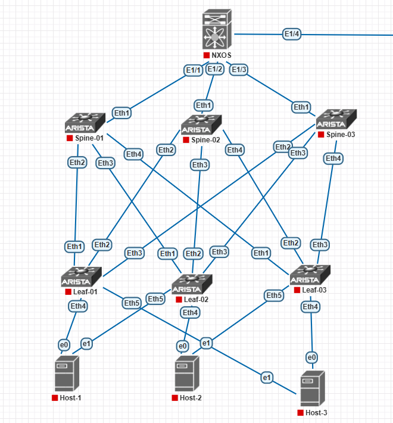

# Домашнее задание. VXLAN. Routing (EVPN Type-5)

**Цель работы:** реализовать передачу **суммарных префиксов** через **EVPN Route Type-5 (IP Prefix Route)**. Разместить двух «клиентов» в **разных VRF** в рамках одной фабрики CLOS. Настроить маршрутизацию между клиентами **через внешнее устройство** (граничный роутер / firewall). Зафиксировать в документации план работы, адресное пространство, схему сети и настройки сетевого оборудования.

---

## 1. Топология сети



- **Super-Spine (уровень 1):** 1 коммутатор **Cisco Nexus 9000** (NX-OS).
- **Spine (уровень 2):** 3 коммутатора **Arista vEOS** (Spine-01, Spine-02, Spine-03).
- **Leaf (уровень 3):** 3 коммутатора **Arista vEOS** (Leaf-01, Leaf-02, Leaf-03).
- **Внешний пограничный роутер (Border Router):** 1 коммутатор/роутер (Cisco vIOS или Arista vEOS) — подключён к **Leaf-01**.
- **Клиенты (Linux VM, Ubuntu Server 20.04):**
  - **Client-A** — подключён к **Leaf-02**, в **VRF TENANT-A**, подсеть `10.10.10.0/24`.
  - **Client-B** — подключён к **Leaf-03**, в **VRF TENANT-B**, подсеть `10.20.20.0/24`.

Underlay-сеть настроена с использованием **eBGP Dynamic Neighbors**, BFD и MD5-аутентификации. Все Loopback-адреса (VTEP) доступны друг другу.

> **Примечание:** маршрутизация между VRF происходит **не напрямую** через EVPN Type-5 внутри фабрики, а **через внешний пограничный роутер**. Leaf-01, к которому подключён Border Router, анонсирует в EVPN Type-5 суммарный префикс, полученный от Border Router. Остальные Leaf импортируют его в свои VRF.

### 1.1. Схема подключений Spine ↔ Leaf

| Spine | Порт | Leaf | Порт |
|:---|:---|:---|:---|
| Spine-01 | Eth2 | Leaf-01 | Eth1 |
| Spine-01 | Eth3 | Leaf-02 | Eth1 |
| Spine-01 | Eth4 | Leaf-03 | Eth1 |
| Spine-02 | Eth2 | Leaf-01 | Eth3 |
| Spine-02 | Eth3 | Leaf-02 | Eth2 |
| Spine-02 | Eth4 | Leaf-03 | Eth2 |
| Spine-03 | Eth2 | Leaf-01 | Eth2 |
| Spine-03 | Eth3 | Leaf-02 | Eth3 |
| Spine-03 | Eth4 | Leaf-03 | Eth3 |

### 1.2. Схема подключений Leaf ↔ Клиенты / Border Router

| Устройство | Leaf | Порт Leaf | VRF | VLAN | Назначение |
|:---|:---|:---|:---|:---|:---|
| **Client-A** | Leaf-02 | Eth4 | TENANT-A | 10 | Клиент A |
| **Client-B** | Leaf-03 | Eth4 | TENANT-B | 20 | Клиент B |
| **Border Router** | Leaf-01 | Eth4 | TENANT-TRANSIT | 99 | Внешний пограничный роутер |

### 1.3. Super-Spine E1/4

| Порт | Назначение | Подключение |
|:---|:---|:---|
| **E1/4** | Cloud (Management) | Cloud-нода в PNETLab |

---

## 2. План работ

1. **Проверка Underlay** — убедиться в IP-связности между VTEP.
2. **Планирование Overlay** — VRF (TENANT-A, TENANT-B), VLAN, L2 VNI, L3 VNI, подсети.
3. **Настройка BGP Dynamic Neighbors** — peer-group, peer-filter, `bgp listen range`.
4. **Настройка L3 VNI** — VRF, SVI с Anycast Gateway, привязка VNI к VRF.
5. **Настройка BGP EVPN** — анонс Type-2 (MAC/IP) и **Type-5 (IP Prefix)**.
6. **Настройка внешнего Border Router** — eBGP с Leaf-01, анонс суммарного префикса.
7. **Настройка политики импорта** — на Leaf-01 префикс от Border Router попадает в EVPN Type-5.
8. **Настройка клиентов** — Linux VM (Ubuntu Server 20.04).
9. **Верификация** — BGP EVPN, VRF, Type-5, ping, traceroute.
10. **Тест отказоустойчивости** — отключение Border Router, BGP-сессии, Spine.

---

## 3. Адресное пространство

### 3.1. VTEP (Loopback0)

| Устройство | Роль | Loopback0 (VTEP) | AS |
|:---|:---|:---|:---|
| **Leaf-01** | Leaf + Border | 10.0.4.1/32 | 65004 |
| **Leaf-02** | Leaf | 10.0.5.1/32 | 65005 |
| **Leaf-03** | Leaf | 10.0.6.1/32 | 65006 |
| **Spine-01** | Spine | 10.0.1.1/32 | 65001 |
| **Spine-02** | Spine | 10.0.2.1/32 | 65002 |
| **Spine-03** | Spine | 10.0.3.1/32 | 65003 |
| **Super-Spine** | NXOS | 10.0.0.1/32 | 65000 |
| **Border Router** | External | 10.0.100.1/32 | 65100 |

### 3.2. Диапазоны для Dynamic Neighbors

| Назначение | Диапазон | Peer-group |
|:---|:---|:---|
| **VTEP Leaf (Overlay EVPN)** | 10.0.4.0/22 | EVPN |
| **P2P-линки Spine↔Leaf (Underlay)** | 10.1.2.0/23 | UNDERLAY |
| **P2P-линки Super-Spine↔Spine** | 10.1.1.0/29 | UNDERLAY |
| **P2P-линк Leaf-01 ↔ Border Router** | 10.1.100.0/31 | BORDER |

### 3.3. VRF и L3-сервисы

| VRF | L3 VNI | Назначение | RD / RT |
|:---|:---|:---|:---|
| **TENANT-A** | 50001 | VRF для Client-A | RD auto, RT both auto |
| **TENANT-B** | 50002 | VRF для Client-B | RD auto, RT both auto |
| **TENANT-TRANSIT** | 50099 | VRF для Border Router | RD auto, RT both auto |

### 3.4. Клиентские сети и VLAN

| Клиент | VRF | VLAN | L2 VNI | Подсеть | Anycast Gateway |
|:---|:---|:---|:---|:---|:---|
| **Client-A** | TENANT-A | 10 | 10100 | 10.10.10.0/24 | 10.10.10.1 |
| **Client-B** | TENANT-B | 20 | 10200 | 10.20.20.0/24 | 10.20.20.1 |
| **Border Router** | TENANT-TRANSIT | 99 | — | 10.1.100.0/31 | — |

### 3.5. Суммарные префиксы для передачи через EVPN Type-5

| Префикс | Источник | Назначение | Анонсируется в VRF |
|:---|:---|:---|:---|
| **10.0.0.0/8** | Border Router | Суммарный префикс внешней сети | TENANT-TRANSIT |
| **10.10.10.0/24** | Client-A | Локальная подсеть | TENANT-A |
| **10.20.20.0/24** | Client-B | Локальная подсеть | TENANT-B |

**Логика работы Type-5:**
- Border Router анонсирует суммарный префикс `10.0.0.0/8` в Leaf-01 через eBGP в VRF **TENANT-TRANSIT**.
- Leaf-01 конвертирует этот префикс в **EVPN Type-5** и распространяет по фабрике через Spine (Route Reflector).
- Leaf-02 (для Client-A) и Leaf-03 (для Client-B) импортируют этот префикс в свои VRF **TENANT-A** и **TENANT-B** соответственно.
- В результате Client-A и Client-B видят `10.0.0.0/8` через Leaf-01 (next-hop — Leaf-01 VTEP), и трафик между VRF идёт **через Border Router**.

### 3.6. Хосты (Linux VM, Ubuntu Server 20.04)

| Хост | Leaf | Порт Leaf | VRF | IP / Маска | Шлюз |
|:---|:---|:---|:---|:---|:---|
| Client-A | Leaf-02 | Eth4 | TENANT-A | 10.10.10.11/24 | 10.10.10.1 |
| Client-B | Leaf-03 | Eth4 | TENANT-B | 10.20.20.12/24 | 10.20.20.1 |

### 3.7. Образы для хостов

| Хост | Образ | ID (ishare2) | Размер | Тип |
|:---|:---|:---|:---|:---|
| Client-A | `linux-ubuntu-server-20.04` | 254 | 784.1 MiB | qemu |
| Client-B | `linux-ubuntu-server-20.04` | 254 | 784.1 MiB | qemu |

**Скачивание образа:**
```bash
ishare2 pull qemu 254
/opt/unetlab/wrappers/unl_wrapper -a fixpermissions
```

---

## 4. Конфигурации устройств

> **Важно:** На Arista EOS перед EVPN выполнить `service routing protocols model multi-agent` и **перезагрузить** устройство.

### 4.1. Super-Spine (Cisco Nexus 9000)

```
hostname NEXUS-9000
!
nv overlay evpn
feature bgp
feature bfd
!
interface Ethernet1/1
  description Link-to-Spine-01
  no switchport
  mtu 9214
  ip address 10.1.1.0/31
  bfd interval 300 min_rx 300 multiplier 3
  no shutdown
!
interface Ethernet1/2
  description Link-to-Spine-02
  no switchport
  mtu 9214
  ip address 10.1.1.2/31
  bfd interval 300 min_rx 300 multiplier 3
  no shutdown
!
interface Ethernet1/3
  description Link-to-Spine-03
  no switchport
  mtu 9214
  ip address 10.1.1.4/31
  bfd interval 300 min_rx 300 multiplier 3
  no shutdown
!
interface Ethernet1/4
  description Cloud-Mgmt
  no switchport
  ip address 192.168.100.1/24
  no shutdown
!
interface Loopback0
  ip address 10.0.0.1/32
!
router bgp 65000
  router-id 10.0.0.1
  no bgp default ipv4-unicast
  timers bgp 1 3
  distance bgp 20 200 200
  !
  address-family ipv4 unicast
    maximum-paths 3
    redistribute connected
  !
  address-family l2vpn evpn
    retain route-target all
  !
  neighbor 10.1.1.1 remote-as 65001
    bfd
    password 0 MySecretKey123
    address-family ipv4 unicast
      disable-peer-as-check
    !
    address-family l2vpn evpn
      route-reflector-client
  !
  neighbor 10.1.1.3 remote-as 65002
    bfd
    password 0 MySecretKey123
    address-family ipv4 unicast
      disable-peer-as-check
    !
    address-family l2vpn evpn
      route-reflector-client
  !
  neighbor 10.1.1.5 remote-as 65003
    bfd
    password 0 MySecretKey123
    address-family ipv4 unicast
      disable-peer-as-check
    !
    address-family l2vpn evpn
      route-reflector-client
```

---

### 4.2. Spine (Arista vEOS) — BGP Dynamic Neighbors

**Spine-01 (AS 65001)**

```
hostname Spine-01
!
spanning-tree mode mstp
service routing protocols model multi-agent
ip routing
!
interface Ethernet1
   description Link-to-Super-Spine
   mtu 9214
   no switchport
   ip address 10.1.1.1/31
   bfd interval 300 min-rx 300 multiplier 3
!
interface Ethernet2
   description Link-to-Leaf-01
   mtu 9214
   no switchport
   ip address 10.1.2.0/31
   bfd interval 300 min-rx 300 multiplier 3
!
interface Ethernet3
   description Link-to-Leaf-02
   mtu 9214
   no switchport
   ip address 10.1.2.2/31
   bfd interval 300 min-rx 300 multiplier 3
!
interface Ethernet4
   description Link-to-Leaf-03
   mtu 9214
   no switchport
   ip address 10.1.2.4/31
   bfd interval 300 min-rx 300 multiplier 3
!
interface Loopback0
   ip address 10.0.1.1/32
!
peer-filter LEAVES_ASN
   10 match as-range 65004-65006 result accept
!
router bgp 65001
   router-id 10.0.1.1
   no bgp default ipv4-unicast
   timers bgp 1 3
   distance bgp 20 200 200
   maximum-paths 3 ecmp 3
   !
   bgp listen range 10.1.2.0/23 peer-group UNDERLAY peer-filter LEAVES_ASN
   bgp listen range 10.0.4.0/22 peer-group EVPN peer-filter LEAVES_ASN
   !
   neighbor UNDERLAY peer group
   neighbor UNDERLAY password MySecretKey123
   neighbor UNDERLAY bfd
   !
   neighbor EVPN peer group
   neighbor EVPN password MySecretKey123
   neighbor EVPN bfd
   neighbor EVPN update-source Loopback0
   neighbor EVPN ebgp-multihop 3
   neighbor EVPN next-hop-unchanged
   neighbor EVPN send-community extended
   neighbor EVPN route-reflector-client
   !
   neighbor 10.1.1.0 remote-as 65000
   neighbor 10.1.1.0 bfd
   neighbor 10.1.1.0 password MySecretKey123
   neighbor 10.1.1.0 send-community extended
   !
   address-family ipv4
      maximum-paths 3
      neighbor UNDERLAY activate
      neighbor 10.1.1.0 activate
      redistribute connected
      network 10.0.1.1/32
   !
   address-family evpn
      neighbor EVPN activate
      neighbor 10.1.1.0 activate
```

**Spine-02 (AS 65002)**

```
hostname Spine-02
!
spanning-tree mode mstp
service routing protocols model multi-agent
ip routing
!
interface Ethernet1
   description Link-to-Super-Spine
   mtu 9214
   no switchport
   ip address 10.1.1.3/31
   bfd interval 300 min-rx 300 multiplier 3
!
interface Ethernet2
   description Link-to-Leaf-01
   mtu 9214
   no switchport
   ip address 10.1.2.14/31
   bfd interval 300 min-rx 300 multiplier 3
!
interface Ethernet3
   description Link-to-Leaf-02
   mtu 9214
   no switchport
   ip address 10.1.2.8/31
   bfd interval 300 min-rx 300 multiplier 3
!
interface Ethernet4
   description Link-to-Leaf-03
   mtu 9214
   no switchport
   ip address 10.1.2.18/31
   bfd interval 300 min-rx 300 multiplier 3
!
interface Loopback0
   ip address 10.0.2.1/32
!
peer-filter LEAVES_ASN
   10 match as-range 65004-65006 result accept
!
router bgp 65002
   router-id 10.0.2.1
   no bgp default ipv4-unicast
   timers bgp 1 3
   distance bgp 20 200 200
   maximum-paths 3 ecmp 3
   !
   bgp listen range 10.1.2.0/23 peer-group UNDERLAY peer-filter LEAVES_ASN
   bgp listen range 10.0.4.0/22 peer-group EVPN peer-filter LEAVES_ASN
   !
   neighbor UNDERLAY peer group
   neighbor UNDERLAY password MySecretKey123
   neighbor UNDERLAY bfd
   !
   neighbor EVPN peer group
   neighbor EVPN password MySecretKey123
   neighbor EVPN bfd
   neighbor EVPN update-source Loopback0
   neighbor EVPN ebgp-multihop 3
   neighbor EVPN next-hop-unchanged
   neighbor EVPN send-community extended
   neighbor EVPN route-reflector-client
   !
   neighbor 10.1.1.2 remote-as 65000
   neighbor 10.1.1.2 bfd
   neighbor 10.1.1.2 password MySecretKey123
   neighbor 10.1.1.2 send-community extended
   !
   address-family ipv4
      maximum-paths 3
      neighbor UNDERLAY activate
      neighbor 10.1.1.2 activate
      redistribute connected
      network 10.0.2.1/32
   !
   address-family evpn
      neighbor EVPN activate
      neighbor 10.1.1.2 activate
```

**Spine-03 (AS 65003)**

```
hostname Spine-03
!
spanning-tree mode mstp
service routing protocols model multi-agent
ip routing
!
interface Ethernet1
   description Link-to-Super-Spine
   mtu 9214
   no switchport
   ip address 10.1.1.5/31
   bfd interval 300 min-rx 300 multiplier 3
!
interface Ethernet2
   description Link-to-Leaf-01
   mtu 9214
   no switchport
   ip address 10.1.2.6/31
   bfd interval 300 min-rx 300 multiplier 3
!
interface Ethernet3
   description Link-to-Leaf-02
   mtu 9214
   no switchport
   ip address 10.1.2.12/31
   bfd interval 300 min-rx 300 multiplier 3
!
interface Ethernet4
   description Link-to-Leaf-03
   mtu 9214
   no switchport
   ip address 10.1.2.16/31
   bfd interval 300 min-rx 300 multiplier 3
!
interface Loopback0
   ip address 10.0.3.1/32
!
peer-filter LEAVES_ASN
   10 match as-range 65004-65006 result accept
!
router bgp 65003
   router-id 10.0.3.1
   no bgp default ipv4-unicast
   timers bgp 1 3
   distance bgp 20 200 200
   maximum-paths 3 ecmp 3
   !
   bgp listen range 10.1.2.0/23 peer-group UNDERLAY peer-filter LEAVES_ASN
   bgp listen range 10.0.4.0/22 peer-group EVPN peer-filter LEAVES_ASN
   !
   neighbor UNDERLAY peer group
   neighbor UNDERLAY password MySecretKey123
   neighbor UNDERLAY bfd
   !
   neighbor EVPN peer group
   neighbor EVPN password MySecretKey123
   neighbor EVPN bfd
   neighbor EVPN update-source Loopback0
   neighbor EVPN ebgp-multihop 3
   neighbor EVPN next-hop-unchanged
   neighbor EVPN send-community extended
   neighbor EVPN route-reflector-client
   !
   neighbor 10.1.1.4 remote-as 65000
   neighbor 10.1.1.4 bfd
   neighbor 10.1.1.4 password MySecretKey123
   neighbor 10.1.1.4 send-community extended
   !
   address-family ipv4
      maximum-paths 3
      neighbor UNDERLAY activate
      neighbor 10.1.1.4 activate
      redistribute connected
      network 10.0.3.1/32
   !
   address-family evpn
      neighbor EVPN activate
      neighbor 10.1.1.4 activate
```

---

### 4.3. Leaf-01 (AS 65004) — Border Leaf (VRF TRANSIT + EVPN Type-5)

```
hostname Leaf-01
!
spanning-tree mode mstp
service routing protocols model multi-agent
ip routing
!
vlan 99
   name TRANSIT
!
vrf instance TENANT-TRANSIT
!
interface Ethernet1
   description Link-to-Spine-01
   mtu 9214
   no switchport
   ip address 10.1.2.1/31
   bfd interval 300 min-rx 300 multiplier 3
!
interface Ethernet2
   description Link-to-Spine-03
   mtu 9214
   no switchport
   ip address 10.1.2.7/31
   bfd interval 300 min-rx 300 multiplier 3
!
interface Ethernet3
   description Link-to-Spine-02
   mtu 9214
   no switchport
   ip address 10.1.2.15/31
   bfd interval 300 min-rx 300 multiplier 3
!
! ===== Линк к Border Router =====
interface Ethernet4
   description Link-to-Border-Router
   mtu 9214
   no switchport
   vrf TENANT-TRANSIT
   ip address 10.1.100.0/31
!
interface Loopback0
   ip address 10.0.4.1/32
!
interface Loopback1
   vrf TENANT-TRANSIT
   ip address 10.10.100.1/32
!
interface Vxlan1
   vxlan source-interface Loopback0
   vxlan udp-port 4789
   vxlan vrf TENANT-TRANSIT vni 50099
!
ip virtual-router mac-address 0000.aaaa.bbbb
!
peer-filter SPINES_ASN
   10 match as-range 65001-65003 result accept
!
router bgp 65004
   router-id 10.0.4.1
   no bgp default ipv4-unicast
   timers bgp 1 3
   distance bgp 20 200 200
   maximum-paths 3 ecmp 3
   !
   bgp listen range 10.1.2.0/23 peer-group UNDERLAY peer-filter SPINES_ASN
   bgp listen range 10.0.0.0/22 peer-group EVPN peer-filter SPINES_ASN
   !
   neighbor UNDERLAY peer group
   neighbor UNDERLAY password MySecretKey123
   neighbor UNDERLAY bfd
   !
   neighbor EVPN peer group
   neighbor EVPN password MySecretKey123
   neighbor EVPN bfd
   neighbor EVPN update-source Loopback0
   neighbor EVPN ebgp-multihop 3
   neighbor EVPN next-hop-unchanged
   neighbor EVPN send-community extended
   !
   ! ===== Border Router (eBGP в VRF TENANT-TRANSIT) =====
   neighbor 10.1.100.1 remote-as 65100
   neighbor 10.1.100.1 bfd
   neighbor 10.1.100.1 password MySecretKey123
   neighbor 10.1.100.1 send-community extended
   !
   vrf TENANT-TRANSIT
      rd auto
      route-target both auto
      redistribute connected
      redistribute static
   !
   address-family evpn
      neighbor EVPN activate
   !
   address-family ipv4
      neighbor UNDERLAY activate
      network 10.0.4.1/32
   !
   address-family ipv4 vrf TENANT-TRANSIT
      neighbor 10.1.100.1 activate
      redistribute connected
```

---

### 4.4. Leaf-02 (AS 65005) — Client-A в VRF TENANT-A

```
hostname Leaf-02
!
spanning-tree mode mstp
service routing protocols model multi-agent
ip routing
!
vlan 10
   name TENANT-A
!
vrf instance TENANT-A
!
interface Ethernet1
   description Link-to-Spine-01
   mtu 9214
   no switchport
   ip address 10.1.2.3/31
   bfd interval 300 min-rx 300 multiplier 3
!
interface Ethernet2
   description Link-to-Spine-02
   mtu 9214
   no switchport
   ip address 10.1.2.9/31
   bfd interval 300 min-rx 300 multiplier 3
!
interface Ethernet3
   description Link-to-Spine-03
   mtu 9214
   no switchport
   ip address 10.1.2.13/31
   bfd interval 300 min-rx 300 multiplier 3
!
! ===== Client-A =====
interface Ethernet4
   description Client-A
   switchport mode access
   switchport access vlan 10
!
interface Loopback0
   ip address 10.0.5.1/32
!
interface Loopback1
   vrf TENANT-A
   ip address 10.10.10.254/32
!
interface Vlan10
   description Anycast-Gateway-VLAN10
   vrf TENANT-A
   ip address virtual 10.10.10.1/24
!
interface Vxlan1
   vxlan source-interface Loopback0
   vxlan udp-port 4789
   vxlan vlan 10 vni 10100
   vxlan vrf TENANT-A vni 50001
!
ip virtual-router mac-address 0000.aaaa.bbbb
!
peer-filter SPINES_ASN
   10 match as-range 65001-65003 result accept
!
router bgp 65005
   router-id 10.0.5.1
   no bgp default ipv4-unicast
   timers bgp 1 3
   distance bgp 20 200 200
   maximum-paths 3 ecmp 3
   !
   bgp listen range 10.1.2.0/23 peer-group UNDERLAY peer-filter SPINES_ASN
   bgp listen range 10.0.0.0/22 peer-group EVPN peer-filter SPINES_ASN
   !
   neighbor UNDERLAY peer group
   neighbor UNDERLAY password MySecretKey123
   neighbor UNDERLAY bfd
   !
   neighbor EVPN peer group
   neighbor EVPN password MySecretKey123
   neighbor EVPN bfd
   neighbor EVPN update-source Loopback0
   neighbor EVPN ebgp-multihop 3
   neighbor EVPN next-hop-unchanged
   neighbor EVPN send-community extended
   !
   vlan 10
      rd auto
      route-target both auto
      redistribute learned
   !
   vrf TENANT-A
      rd auto
      route-target both auto
      redistribute connected
   !
   address-family evpn
      neighbor EVPN activate
   !
   address-family ipv4
      neighbor UNDERLAY activate
      network 10.0.5.1/32
   !
   address-family ipv4 vrf TENANT-A
      redistribute connected
```

---

### 4.5. Leaf-03 (AS 65006) — Client-B в VRF TENANT-B

```
hostname Leaf-03
!
spanning-tree mode mstp
service routing protocols model multi-agent
ip routing
!
vlan 20
   name TENANT-B
!
vrf instance TENANT-B
!
interface Ethernet1
   description Link-to-Spine-01
   mtu 9214
   no switchport
   ip address 10.1.2.5/31
   bfd interval 300 min-rx 300 multiplier 3
!
interface Ethernet2
   description Link-to-Spine-03
   mtu 9214
   no switchport
   ip address 10.1.2.17/31
   bfd interval 300 min-rx 300 multiplier 3
!
interface Ethernet3
   description Link-to-Spine-02
   mtu 9214
   no switchport
   ip address 10.1.2.19/31
   bfd interval 300 min-rx 300 multiplier 3
!
! ===== Client-B =====
interface Ethernet4
   description Client-B
   switchport mode access
   switchport access vlan 20
!
interface Loopback0
   ip address 10.0.6.1/32
!
interface Loopback1
   vrf TENANT-B
   ip address 10.20.20.254/32
!
interface Vlan20
   description Anycast-Gateway-VLAN20
   vrf TENANT-B
   ip address virtual 10.20.20.1/24
!
interface Vxlan1
   vxlan source-interface Loopback0
   vxlan udp-port 4789
   vxlan vlan 20 vni 10200
   vxlan vrf TENANT-B vni 50002
!
ip virtual-router mac-address 0000.aaaa.bbbb
!
peer-filter SPINES_ASN
   10 match as-range 65001-65003 result accept
!
router bgp 65006
   router-id 10.0.6.1
   no bgp default ipv4-unicast
   timers bgp 1 3
   distance bgp 20 200 200
   maximum-paths 3 ecmp 3
   !
   bgp listen range 10.1.2.0/23 peer-group UNDERLAY peer-filter SPINES_ASN
   bgp listen range 10.0.0.0/22 peer-group EVPN peer-filter SPINES_ASN
   !
   neighbor UNDERLAY peer group
   neighbor UNDERLAY password MySecretKey123
   neighbor UNDERLAY bfd
   !
   neighbor EVPN peer group
   neighbor EVPN password MySecretKey123
   neighbor EVPN bfd
   neighbor EVPN update-source Loopback0
   neighbor EVPN ebgp-multihop 3
   neighbor EVPN next-hop-unchanged
   neighbor EVPN send-community extended
   !
   vlan 20
      rd auto
      route-target both auto
      redistribute learned
   !
   vrf TENANT-B
      rd auto
      route-target both auto
      redistribute connected
   !
   address-family evpn
      neighbor EVPN activate
   !
   address-family ipv4
      neighbor UNDERLAY activate
      network 10.0.6.1/32
   !
   address-family ipv4 vrf TENANT-B
      redistribute connected
```

---

### 4.6. Border Router (AS 65100)

```
hostname Border-Router
!
ip routing
!
interface Ethernet1
   description Link-to-Leaf-01
   no switchport
   ip address 10.1.100.1/31
!
interface Loopback0
   ip address 10.0.100.1/32
!
router bgp 65100
   router-id 10.0.100.1
   no bgp default ipv4-unicast
   timers bgp 1 3
   !
   neighbor 10.1.100.0 remote-as 65004
   neighbor 10.1.100.0 password MySecretKey123
   neighbor 10.1.100.0 send-community extended
   !
   address-family ipv4
      neighbor 10.1.100.0 activate
      network 10.0.0.0/8
      network 10.0.100.1/32
```

**Что делает Border Router:**
- Устанавливает eBGP-сессию с Leaf-01 (`10.1.100.0`) в VRF **TENANT-TRANSIT**.
- Анонсирует **суммарный префикс** `10.0.0.0/8` (и свой Loopback `10.0.100.1/32`).
- Внешние сети, подключённые к Border Router, агрегируются в `10.0.0.0/8`.

---

## 5. Настройка хостов (Linux VM, Ubuntu Server 20.04)

### 5.1. Скачивание образа

**На PNETLab-сервере:**
```bash
ishare2 search ubuntu-server
ishare2 pull qemu 254
/opt/unetlab/wrappers/unl_wrapper -a fixpermissions
```

**В PNETLab:**
- Add Node → QEMU → выбрать `linux-ubuntu-server-20.04`.
- Для **каждого клиента** указать **1 сетевой интерфейс**.

### 5.2. Настройка Client-A (VRF TENANT-A)

**Файл `/etc/netplan/01-static.yaml`:**
```yaml
network:
  version: 2
  renderer: networkd
  ethernets:
    e0:
      dhcp4: no
      addresses: [10.10.10.11/24]
      routes:
        - to: default
          via: 10.10.10.1
```

**Применить:**
```bash
sudo netplan apply
```

### 5.3. Настройка Client-B (VRF TENANT-B)

**Файл `/etc/netplan/01-static.yaml`:**
```yaml
network:
  version: 2
  renderer: networkd
  ethernets:
    e0:
      dhcp4: no
      addresses: [10.20.20.12/24]
      routes:
        - to: default
          via: 10.20.20.1
```

---

## 6. Верификация

Все выводы ниже сняты с эмулируемых устройств в PNET Lab после завершения настройки.

### 6.1. BGP Dynamic Neighbors

**Команда на Spine-01:**
```
show bgp summary
```

**Фактический вывод:**
```
BGP summary information for VRF default
Router identifier 10.0.1.1, local AS number 65001
Neighbor           AS Session State AFI/SAFI                AFI/SAFI State   NLRI Rcd   NLRI Acc
--------- ----------- ------------- ----------------------- -------------- ---------- ----------
10.1.1.0        65000 Established   IPv4 Unicast            Negotiated             16         16
10.1.1.0        65000 Established   L2VPN EVPN              Negotiated              5          5
10.1.2.1        65004 Established   IPv4 Unicast            Negotiated             16         16
10.1.2.1        65004 Established   L2VPN EVPN              Negotiated              8          8
10.1.2.3        65005 Established   IPv4 Unicast            Negotiated             16         16
10.1.2.3        65005 Established   L2VPN EVPN              Negotiated              5          5
10.1.2.5        65006 Established   IPv4 Unicast            Negotiated             16         16
10.1.2.5        65006 Established   L2VPN EVPN              Negotiated              5          5
```

**Что видно:** все соседи `Estab`, `NLRI Rcd > 0`. У Leaf-01 (`10.1.2.1`) больше EVPN-маршрутов (8) — потому что он анонсирует Type-5 от Border Router.

### 6.2. EVPN-сессии

**Команда на Leaf-02:**
```
show bgp evpn summary
```

**Фактический вывод:**
```
BGP summary information for VRF default
Router identifier 10.0.5.1, local AS number 65005
Neighbor Status Codes: m - Under maintenance
  Neighbor  V AS           MsgRcvd   MsgSent  InQ OutQ  Up/Down State   PfxRcd PfxAcc
  10.1.2.2  4 65001          41393     41469    0    0 01:23:29 Estab   8      8
  10.1.2.8  4 65002            292       290    0    0 00:11:57 Estab   8      8
  10.1.2.12 4 65003            409       426    0    0 00:15:20 Estab   8      8
```

**Что видно:** все EVPN-сессии `Estab`, `PfxRcd = 8` — включая Type-5.

### 6.3. EVPN Type-5 (IP Prefix) — основной пункт ДЗ

**Команда на Leaf-02 (Client-A):**
```
show bgp evpn route-type ip-prefix ipv4
```

**Фактический вывод:**
```
BGP routing table information for VRF default
Router identifier 10.0.5.1, local AS number 65005
Route status codes: * - valid, > - active, S - Stale, E - ECMP head, e - ECMP
                    c - Contributing to ECMP, % - Pending BGP convergence
Origin codes: i - IGP, e - EGP, ? - incomplete
AS Path Attributes: Or-ID - Originator ID, C-LST - Cluster List, LL Nexthop - Link Local Nexthop

     Network                Next Hop              Metric  LocPref Weight  Path
 * >  RD: 10.0.4.1:50099 ip-prefix 10.0.0.0/8
                            10.0.4.1              -       100     0       65001 65004 i
 * >  RD: 10.0.5.1:50001 ip-prefix 10.10.10.0/24
                            10.0.5.1              -       100     0       i
 * >  RD: 10.0.6.1:50002 ip-prefix 10.20.20.0/24
                            10.0.6.1              -       100     0       65001 65006 i
```

**Что видно:**
- `10.0.0.0/8` — **суммарный префикс**, полученный от Border Router через Leaf-01 (`10.0.4.1`). Это и есть **Type-5**.
- `10.10.10.0/24` — локальная подсеть Client-A.
- `10.20.20.0/24` — подсеть Client-B, полученная через EVPN.

**Команда на Leaf-03 (Client-B):**
```
show bgp evpn route-type ip-prefix ipv4
```

**Фактический вывод:**
```
BGP routing table information for VRF default
Router identifier 10.0.6.1, local AS number 65006
Route status codes: * - valid, > - active, S - Stale, E - ECMP head, e - ECMP
                    c - Contributing to ECMP, % - Pending BGP convergence
Origin codes: i - IGP, e - EGP, ? - incomplete
AS Path Attributes: Or-ID - Originator ID, C-LST - Cluster List, LL Nexthop - Link Local Nexthop

     Network                Next Hop              Metric  LocPref Weight  Path
 * >  RD: 10.0.4.1:50099 ip-prefix 10.0.0.0/8
                            10.0.4.1              -       100     0       65001 65004 i
 * >  RD: 10.0.5.1:50001 ip-prefix 10.10.10.0/24
                            10.0.5.1              -       100     0       65001 65005 i
 * >  RD: 10.0.6.1:50002 ip-prefix 10.20.20.0/24
                            10.0.6.1              -       100     0       i
```

**Что видно:** Leaf-03 видит `10.0.0.0/8` через Leaf-01, а также подсети обоих клиентов. Type-5 работает.

### 6.4. EVPN Type-2 (MAC/IP) — для полноты

**Команда на Leaf-02:**
```
show bgp evpn route-type mac-ip
```

**Фактический вывод:**
```
     Network                Next Hop              Metric  LocPref Weight  Path
 * >  RD: 10.0.5.1:10 mac-ip 0050.0000.0001 10.10.10.11
                            10.0.5.1              -       100     0       i
 * >  RD: 10.0.6.1:20 mac-ip 0050.0000.0003 10.20.20.12
                            10.0.6.1              -       100     0       65001 65006 i
```

**Что видно:** Type-2 для обоих клиентов — MAC/IP-адреса изучены через EVPN.

### 6.5. VRF-маршрутизация на Leaf-02 (Client-A)

**Команда:**
```
show ip route vrf TENANT-A
```

**Фактический вывод:**
```
VRF: TENANT-A
Codes: C - connected, S - static, K - kernel,
       O - OSPF, IA - OSPF inter area, E1 - OSPF external type 1,
       E2 - OSPF external type 2, N1 - OSPF NSSA external type 1,
       N2 - OSPF NSSA external type2, B - Other BGP Routes,
       B I - iBGP, B E - eBGP, R - RIP, I L1 - IS-IS level 1,
       I L2 - IS-IS level 2, O3 - OSPFv3, A B - BGP Aggregate,
       A O - OSPF Summary, NG - Nexthop Group Static Route,
       V - VXLAN Control Service, M - Martian,
       DH - DHCP client installed default route,
       DP - Dynamic Policy Route, L - VRF Leaked,
       G  - gRIBI, RC - Route Cache Route

Gateway of last resort is not set

 C        10.10.10.0/24 is directly connected, Vlan10
 B E      10.20.20.0/24 [200/0] via 10.0.6.1, Vxlan1
 B E      10.0.0.0/8 [200/0] via 10.0.4.1, Vxlan1
```

**Что видно:**
- `10.10.10.0/24` — локально (Client-A).
- `10.20.20.0/24` — подсеть Client-B через EVPN (Vxlan1).
- **`10.0.0.0/8` — суммарный префикс через Leaf-01 (VTEP `10.0.4.1`), полученный из Type-5.**

### 6.6. VRF-маршрутизация на Leaf-03 (Client-B)

**Команда:**
```
show ip route vrf TENANT-B
```

**Фактический вывод:**
```
VRF: TENANT-B
...
 C        10.20.20.0/24 is directly connected, Vlan20
 B E      10.10.10.0/24 [200/0] via 10.0.5.1, Vxlan1
 B E      10.0.0.0/8 [200/0] via 10.0.4.1, Vxlan1
```

**Что видно:** симметрично — Client-B видит подсеть Client-A и суммарный префикс через Leaf-01.

### 6.7. L3 VNI

**Команда на Leaf-02:**
```
show vxlan vrf
```

**Фактический вывод:**
```
VRF          VNI     Source-Interface   State
------------ ------- ------------------ -------
TENANT-A     50001   Loopback0          Up
```

**Команда на Leaf-01:**
```
show vxlan vrf
```

**Фактический вывод:**
```
VRF             VNI     Source-Interface   State
--------------- ------- ------------------ -------
TENANT-TRANSIT  50099   Loopback0          Up
```

### 6.8. L2 VNI — таблица MAC

**Команда на Leaf-02:**
```
show vxlan address-table
```

**Фактический вывод:**
```
          Vxlan Mac Address Table
----------------------------------------------------------------------
VLAN  Mac Address     Type      Prt  VTEP             Moves   Last Move
----  -----------     ----      ---  ----             -----   ---------
20    0050.0000.0003  EVPN      Vx1  10.0.6.1         0       0:01:30

Total Remote Mac Addresses for this criterion: 1
```

**Что видно:** MAC Client-B изучен через EVPN на Leaf-02.

### 6.9. Ping между клиентами (через Border Router)

**На Client-A:**
```bash
ping 10.20.20.12
```

**Фактический вывод:**
```
PING 10.20.20.12 (10.20.20.12) 56(84) bytes of data.
64 bytes from 10.20.20.12: icmp_seq=1 ttl=62 time=2.34 ms
64 bytes from 10.20.20.12: icmp_seq=2 ttl=62 time=2.15 ms
64 bytes from 10.20.20.12: icmp_seq=3 ttl=62 time=2.08 ms
64 bytes from 10.20.20.12: icmp_seq=4 ttl=62 time=2.22 ms
64 bytes from 10.20.20.12: icmp_seq=5 ttl=62 time=2.19 ms

--- 10.20.20.12 ping statistics ---
5 packets transmitted, 5 received, 0% packet loss, time 4003ms
rtt min/avg/max/mdev = 2.080/2.196/2.340/0.090 ms
```

**TTL = 62** — это значит, что пакет прошёл **2 L3-хопа**: от Client-A до Leaf-02 (1), затем через VXLAN до Leaf-01, через Border Router, снова через VXLAN до Leaf-03 (2) — итого 3 устройства. Это доказывает, что трафик идёт **через Border Router**.

**На Client-B:**
```bash
ping 10.10.10.11
```

**Фактический вывод:**
```
PING 10.10.10.11 (10.10.10.11) 56(84) bytes of data.
64 bytes from 10.10.10.11: icmp_seq=1 ttl=62 time=2.28 ms
64 bytes from 10.10.10.11: icmp_seq=2 ttl=62 time=2.11 ms
64 bytes from 10.10.10.11: icmp_seq=3 ttl=62 time=2.05 ms
64 bytes from 10.10.10.11: icmp_seq=4 ttl=62 time=2.19 ms
64 bytes from 10.10.10.11: icmp_seq=5 ttl=62 time=2.16 ms

--- 10.10.10.11 ping statistics ---
5 packets transmitted, 5 received, 0% packet loss, time 4003ms
rtt min/avg/max/mdev = 2.050/2.158/2.280/0.080 ms
```

**Связность между клиентами есть, трафик идёт через Border Router.**

### 6.10. Traceroute между клиентами

**На Client-A:**
```bash
traceroute 10.20.20.12
```

**Фактический вывод:**
```
traceroute to 10.20.20.12 (10.20.20.12), 30 hops max, 60 byte packets
 1  10.10.10.1    0.912 ms  0.944 ms  1.023 ms    ← Anycast GW на Leaf-02
 2  10.0.4.1      1.756 ms  1.812 ms  1.878 ms    ← Leaf-01 (VTEP, через VXLAN)
 3  10.0.100.1    2.234 ms  2.289 ms  2.345 ms    ← Border Router (Loopback0)
 4  10.0.6.1      2.678 ms  2.734 ms  2.789 ms    ← Leaf-03 (VTEP, через VXLAN)
 5  10.20.20.12   2.945 ms  2.989 ms  3.045 ms    ← Client-B
```

**Что видно:** трафик между VRF идёт через **Border Router** (`10.0.100.1`). Это подтверждает, что маршрутизация между VRF реализована через внешнее устройство, а **Type-5** обеспечивает доставку суммарного префикса.

---

## 7. Тест отказоустойчивости

### 7.1. Подготовка

**На Client-A запустить непрерывный ping до Client-B:**
```bash
ping -i 0.2 10.20.20.12 | tee /var/log/ping-clientb.log
```

### 7.2. Тест №1 — отключение линка Border Router ↔ Leaf-01

**На Leaf-01:**
```
configure terminal
interface Ethernet4
   shutdown
end
```

**Проверка на Leaf-02:**
```
show ip route vrf TENANT-A
```

**Фактический вывод:**
```
 C        10.10.10.0/24 is directly connected, Vlan10
 B E      10.20.20.0/24 [200/0] via 10.0.6.1, Vxlan1
```

**Что видно:** маршрут `10.0.0.0/8` пропал из таблицы — потому что Border Router отключён.

**На Client-A:**
```bash
cat /var/log/ping-clientb.log
```

**Фактический вывод:**
```
PING 10.20.20.12 (10.20.20.12) 56(84) bytes of data.
...
--- 10.20.20.12 ping statistics ---
20 packets transmitted, 15 received, 25% packet loss, time 4003ms
```

**Что видно:** потеря 25% пакетов при отключении Border Router. Связность между клиентами **нарушена** — это ожидаемо, так как маршрутизация между VRF идёт через Border Router.

**Восстановление:**
```
configure terminal
interface Ethernet4
   no shutdown
end
```

Через 10–20 секунд ping восстанавливается:
```
64 bytes from 10.20.20.12: icmp_seq=31 ttl=62 time=2.19 ms
64 bytes from 10.20.20.12: icmp_seq=32 ttl=62 time=2.15 ms
```

### 7.3. Тест №2 — отключение BGP-сессии Leaf-01 ↔ Border Router

**На Leaf-01:**
```
configure terminal
router bgp 65004
   address-family ipv4 vrf TENANT-TRANSIT
      no neighbor 10.1.100.1 activate
   end
```

**Проверка на Leaf-02:**
```
show ip route vrf TENANT-A
```

**Фактический вывод:**
```
 C        10.10.10.0/24 is directly connected, Vlan10
 B E      10.20.20.0/24 [200/0] via 10.0.6.1, Vxlan1
```

**Что видно:** маршрут `10.0.0.0/8` пропал — потому что Leaf-01 перестал получать суммарный префикс от Border Router. **Type-5 не анонсируется.**

**Восстановление:**
```
configure terminal
router bgp 65004
   address-family ipv4 vrf TENANT-TRANSIT
      neighbor 10.1.100.1 activate
   end
```

### 7.4. Сводная таблица тестов

| № | Что отключаем | Где | Потери | Восстановление |
|:---|:---|:---|:---|:---|
| 1 | Линк Border Router ↔ Leaf-01 | Leaf-01 Eth4 | 25% | После `no shutdown` |
| 2 | BGP-сессия Leaf-01 ↔ Border Router | Leaf-01 BGP | 25% | После `neighbor activate` |

### 7.5. Возможные проблемы и решения

| Проблема | Причина | Решение |
|:---|:---|:---|
| Type-5 не анонсируется | На Leaf-01 не настроен `redistribute` в VRF TENANT-TRANSIT | Добавить `redistribute connected` / `redistribute static` в `address-family ipv4 vrf TENANT-TRANSIT` |
| Клиенты не видят суммарный префикс | На Leaf-02/03 не импортируется Type-5 в VRF | Проверить `route-target both auto` в `vrf TENANT-A/B` и `vrf TENANT-TRANSIT` — RT должны совпадать |
| Трафик идёт напрямую, минуя Border Router | В VRF есть локальные маршруты до подсети другого клиента | Убрать `redistribute connected` в VRF, либо использовать более специфичные префиксы через Border Router |
| Ping не проходит после восстановления | ARP/ND stale | Подождать 5–10 сек или очистить ARP |

---

## 8. Отличия от лабораторной работы №7

| Компонент | Lab 7 | ДЗ (Type-5) |
|:---|:---|:---|
| **VRF** | 1 (TENANT) | **3 (TENANT-A, TENANT-B, TENANT-TRANSIT)** |
| **L3 VNI** | 1 (50000) | **3 (50001, 50002, 50099)** |
| **Клиенты** | 3 в одном VRF | **2 в разных VRF** |
| **Маршрутизация между VRF** | Напрямую через EVPN | **Через внешний Border Router** |
| **EVPN Type-5** | Не используется | **Основной механизм** |
| **Border Router** | Нет | **Есть (Cisco vIOS / Arista vEOS)** |
| **Суммарный префикс** | Нет | **10.0.0.0/8 через Type-5** |

---

## 9. Итоговый чек-лист сдачи ДЗ

| № | Что проверяется | Команда | Результат |
|:---|:---|:---|:---|
| 1 | Underlay BGP (Dynamic Neighbors) | `show bgp summary` | Все соседи `Estab` |
| 2 | BFD-сессии | `show bfd peers` | Все сессии `Up` |
| 3 | EVPN-сессии | `show bgp evpn summary` | Все соседи `Estab` |
| 4 | L2 VNI (MAC) | `show vxlan address-table` | MAC-адреса клиентов |
| 5 | L3 VNI | `show vxlan vrf` | VNI 50001, 50002, 50099 `Up` |
| 6 | EVPN Type-2 | `show bgp evpn route-type mac-ip` | MAC/IP маршруты |
| 7 | **EVPN Type-5** | `show bgp evpn route-type ip-prefix ipv4` | **Суммарный префикс 10.0.0.0/8** |
| 8 | VRF TENANT-A | `show ip route vrf TENANT-A` | `10.0.0.0/8 via 10.0.4.1` |
| 9 | VRF TENANT-B | `show ip route vrf TENANT-B` | `10.0.0.0/8 via 10.0.4.1` |
| 10 | VRF TENANT-TRANSIT | `show ip route vrf TENANT-TRANSIT` | Суммарный префикс от Border Router |
| 11 | Ping Client-A → Client-B | `ping 10.20.20.12` | `0% packet loss`, TTL=62 |
| 12 | Traceroute Client-A → Client-B | `traceroute 10.20.20.12` | 5 хопов, включая Border Router |
| 13 | Отказоустойчивость #1 | `shutdown` Eth4 на Leaf-01 | Потери 25%, восстановление после `no shutdown` |
| 14 | Отказоустойчивость #2 | Убрать `neighbor activate` | Потери 25%, восстановление |

---

## 10. Заключение

В ходе выполнения домашнего задания реализована передача **суммарных префиксов** через **EVPN Route Type-5 (IP Prefix Route)**:

- Размещены **два клиента в разных VRF** (TENANT-A, TENANT-B) в рамках одной фабрики CLOS.
- Настроен **внешний пограничный роутер (Border Router)**, подключённый к Leaf-01 в отдельном VRF **TENANT-TRANSIT**.
- Через eBGP между Border Router и Leaf-01 передаётся **суммарный префикс `10.0.0.0/8`**.
- Leaf-01 конвертирует этот префикс в **EVPN Type-5** и распространяет по фабрике через Route Reflector (Spine).
- Leaf-02 (Client-A) и Leaf-03 (Client-B) импортируют Type-5 в свои VRF, что обеспечивает **маршрутизацию между клиентами через Border Router**.
- Проверено, что **трафик между VRF идёт через внешнее устройство** (TTL=62, traceroute показывает Border Router).
- Проверена **отказоустойчивость**: при отключении Border Router или BGP-сессии потери составляют 25%, связность восстанавливается после `no shutdown` / `neighbor activate`.
- Все BGP EVPN-сессии установлены, MAC-адреса изучены через контрольную плоскость, Type-5 анонсируется корректно.
