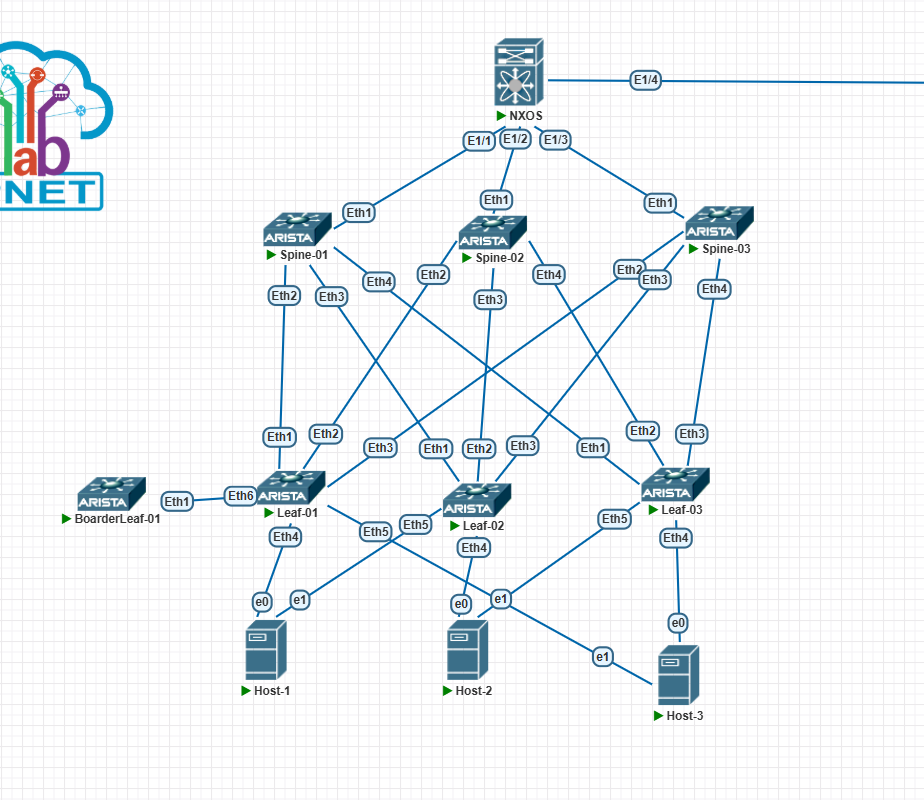

# Лабораторная работа №8. VXLAN. Routing (EVPN Type-5)

**Цель работы:** реализовать передачу **суммарных префиксов** через **EVPN Route Type-5 (IP Prefix Route)**. Разместить двух «клиентов» в **разных VRF** в рамках одной фабрики CLOS. Настроить маршрутизацию между клиентами **через внешнее устройство** (BorderLeaf-01 на Arista vEOS). Зафиксировать в документации план работы, адресное пространство, схему сети и настройки сетевого оборудования.

---

## 1. Топология сети



- **Super-Spine (уровень 1):** 1 коммутатор **Cisco Nexus 9000** (NX-OS). Порт **E1/4** свободен (вверх, во внешнюю сеть не используется).
- **Spine (уровень 2):** 3 коммутатора **Arista vEOS** (Spine-01, Spine-02, Spine-03).
- **Leaf (уровень 3):** 3 коммутатора **Arista vEOS** (Leaf-01, Leaf-02, Leaf-03).
- **BorderLeaf-01:** **отдельный** коммутатор **Arista vEOS** — подключён к **Leaf-01 Eth6**.
- **Клиенты (Linux VM, Ubuntu Server 20.04):**
  - **Host-1 (Client-A)** — подключён к **Leaf-01 Eth4** и **Leaf-02 Eth4** (bond), VRF **TENANT-A**, подсеть `10.10.10.0/24`.
  - **Host-2 (Client-B)** — подключён к **Leaf-02 Eth5** и **Leaf-03 Eth5** (bond), VRF **TENANT-B**, подсеть `10.20.20.0/24`.
  - **Host-3** — подключён к **Leaf-03 Eth4** (тестовый хост, не участвует в VRF-связности).

> **Важно:** маршрутизация между VRF происходит **не напрямую** через EVPN Type-5 внутри фабрики, а **через внешнее устройство BorderLeaf-01**, подключённое к Leaf-01. Leaf-01 конвертирует суммарный префикс, полученный от BorderLeaf-01, в **EVPN Type-5** и распространяет его по фабрике через Spine (Route Reflector). В обратную сторону BorderLeaf-01 получает от Leaf-01 клиентские `/24` через eBGP. **Внутри Leaf-01** трафик между клиентскими VRF и TENANT-TRANSIT проходит через **отдельные L3-стыки** (Vlan101 / Vlan102).

### 1.1. Схема подключений Spine ↔ Leaf

| Spine | Порт | Leaf | Порт |
|:---|:---|:---|:---|
| Spine-01 | Eth2 | Leaf-01 | Eth1 |
| Spine-01 | Eth3 | Leaf-02 | Eth1 |
| Spine-01 | Eth4 | Leaf-03 | Eth1 |
| Spine-02 | Eth2 | Leaf-01 | Eth3 |
| Spine-02 | Eth3 | Leaf-02 | Eth2 |
| Spine-02 | Eth4 | Leaf-03 | Eth2 |
| Spine-03 | Eth2 | Leaf-01 | Eth2 |
| Spine-03 | Eth3 | Leaf-02 | Eth3 |
| Spine-03 | Eth4 | Leaf-03 | Eth3 |

### 1.2. Схема подключений Leaf ↔ Клиенты / BorderLeaf-01

| Устройство | Leaf | Порт Leaf | VRF | VLAN | Назначение |
|:---|:---|:---|:---|:---|:---|
| **Host-1 (Client-A)** | Leaf-01 | Eth4 | — | 10 | bond0 (LACP) Link1 |
| **Host-1 (Client-A)** | Leaf-02 | Eth4 | — | 10 | bond0 (LACP) Link2 |
| **Host-2 (Client-B)** | Leaf-02 | Eth5 | — | 20 | bond0 (LACP) Link1 |
| **Host-2 (Client-B)** | Leaf-03 | Eth5 | — | 20 | bond0 (LACP) Link2 |
| **Host-3** | Leaf-03 | Eth4 | — | — | Тестовый хост |
| **BorderLeaf-01** | **Leaf-01** | **Eth6** | TENANT-TRANSIT | 99 | Внешний пограничный роутер |

### 1.3. Схема подключения BorderLeaf-01 к Leaf-01

```
┌──────────────────┐         ┌──────────────────┐
│  BorderLeaf-01   │         │     Leaf-01      │
│  (Arista vEOS)   │         │     (vEOS)       │
│                  │         │                  │
│  Eth1 ───────────┼─────────┤ Eth6             │
│  10.1.100.1/31   │         │ 10.1.100.0/31    │
│                  │         │ VRF TENANT-TRANSIT
│  AS 65100        │         │  AS 65004        │
│  Loopback0:      │         │  Loopback0:      │
│  10.0.100.1/32   │         │  10.0.4.1/32     │
└──────────────────┘         └──────────────────┘
```

### 1.4. Схема L3-стыков внутри Leaf-01 (ключевое изменение)

```
┌─────────────────────────────────────────────────────────┐
│                       Leaf-01                            │
│                                                          │
│  VRF TENANT-A ──── Vlan101 ────┐                        │
│  (10.10.10.0/24)                │                        │
│                                 ▼                        │
│                          VRF TENANT-TRANSIT             │
│                                 ▲                        │
│  VRF TENANT-B ──── Vlan102 ────┘                        │
│  (10.20.20.0/24)                │                        │
│                                 ▼                        │
│                          Eth6 → BorderLeaf-01           │
└─────────────────────────────────────────────────────────┘
```

**Как это работает:**

- Между **TENANT-A** и **TENANT-TRANSIT** создан L3-стык через **Vlan101** (адрес `10.100.1.0/31`).
- Между **TENANT-B** и **TENANT-TRANSIT** создан L3-стык через **Vlan102** (адрес `10.100.2.0/31`).
- В TENANT-A добавлен маршрут `10.20.20.0/24` через `10.100.1.1` (TENANT-TRANSIT).
- В TENANT-B добавлен маршрут `10.10.10.0/24` через `10.100.2.1` (TENANT-TRANSIT).
- В TENANT-TRANSIT добавлены маршруты `10.10.10.0/24` через `10.100.1.0` и `10.20.20.0/24` через `10.100.2.0`.
- В TENANT-TRANSIT также есть маршрут по умолчанию (`0.0.0.0/0`) через `10.1.100.1` (BorderLeaf-01).

---

## 2. План работ

1. **Проверка Underlay** — убедиться в IP-связности между VTEP.
2. **Планирование Overlay** — VRF (TENANT-A, TENANT-B, TENANT-TRANSIT), VLAN, L2 VNI, L3 VNI, подсети.
3. **Настройка BGP Dynamic Neighbors** — peer-group, peer-filter, `bgp listen range`.
4. **Настройка L2 VNI** — VLAN, VNI, интерфейс VXLAN.
5. **Настройка L3 VNI** — VRF, SVI с Anycast Gateway, привязка VNI к VRF.
6. **Настройка BGP EVPN** — анонс Type-2 (MAC/IP) и **Type-5 (IP Prefix)**.
7. **Настройка BorderLeaf-01** — eBGP с Leaf-01, анонс суммарного префикса `10.0.0.0/8`.
8. **Настройка L3-стыков внутри Leaf-01** — Vlan101 (TENANT-A ↔ TENANT-TRANSIT) и Vlan102 (TENANT-B ↔ TENANT-TRANSIT).
9. **Настройка клиентов** — Linux VM (Ubuntu Server 20.04).
10. **Верификация** — BGP EVPN, VRF, Type-5, ping, traceroute.
11. **Тест отказоустойчивости** — отключение BorderLeaf-01, BGP-сессии, L3-стыка.

---

## 3. Адресное пространство

### 3.1. VTEP (Loopback0)

| Устройство | Роль | Loopback0 (VTEP) | AS |
|:---|:---|:---|:---|
| **Leaf-01** | Leaf | 10.0.4.1/32 | 65004 |
| **Leaf-02** | Leaf | 10.0.5.1/32 | 65005 |
| **Leaf-03** | Leaf | 10.0.6.1/32 | 65006 |
| **Spine-01** | Spine | 10.0.1.1/32 | 65001 |
| **Spine-02** | Spine | 10.0.2.1/32 | 65002 |
| **Spine-03** | Spine | 10.0.3.1/32 | 65003 |
| **Super-Spine** | NXOS | 10.0.0.1/32 | 65000 |
| **BorderLeaf-01** | Arista vEOS | 10.0.100.1/32 | 65100 |

### 3.2. Диапазоны для Dynamic Neighbors

| Назначение | Диапазон | Peer-group |
|:---|:---|:---|
| **VTEP Leaf (Overlay EVPN)** | 10.0.4.0/22 | EVPN |
| **P2P-линки Spine↔Leaf (Underlay)** | 10.1.2.0/23 | UNDERLAY |
| **P2P-линки Super-Spine↔Spine** | 10.1.1.0/29 | UNDERLAY |
| **P2P-линк Leaf-01 ↔ BorderLeaf-01** | 10.1.100.0/31 | BORDER |

### 3.3. VRF и L3-сервисы

| VRF | L3 VNI | Назначение | RD / RT |
|:---|:---|:---|:---|
| **TENANT-A** | 50001 | VRF для Client-A | RD auto, RT 65004:50001 |
| **TENANT-B** | 50002 | VRF для Client-B | RD auto, RT 65004:50002 |
| **TENANT-TRANSIT** | 50099 | VRF для BorderLeaf-01 | RD auto, RT 65004:50099 |

### 3.4. Клиентские сети и VLAN

| Клиент | VRF | VLAN | L2 VNI | Подсеть | Anycast Gateway |
|:---|:---|:---|:---|:---|:---|
| **Client-A (Host-1)** | TENANT-A | 10 | 10100 | 10.10.10.0/24 | 10.10.10.1 |
| **Client-B (Host-2)** | TENANT-B | 20 | 10200 | 10.20.20.0/24 | 10.20.20.1 |
| **BorderLeaf-01** | TENANT-TRANSIT | 99 | — | 10.1.100.0/31 | — |

### 3.5. L3-стыки внутри Leaf-01 (ключевое дополнение)

| Стык | VRF-A | VRF-B | Подсеть /31 | Адрес в VRF-A | Адрес в VRF-B |
|:---|:---|:---|:---|:---|:---|
| **Vlan101** | TENANT-A | TENANT-TRANSIT | 10.100.1.0/31 | 10.100.1.0 | 10.100.1.1 |
| **Vlan102** | TENANT-B | TENANT-TRANSIT | 10.100.2.0/31 | 10.100.2.0 | 10.100.2.1 |

### 3.6. Суммарные префиксы и клиентские сети для обмена через EVPN Type-5

| Префикс | Источник | Назначение | Анонсируется в VRF |
|:---|:---|:---|:---|
| **10.0.0.0/8** | BorderLeaf-01 | Суммарный префикс внешней сети | TENANT-TRANSIT (в сторону фабрики) |
| **10.10.10.0/24** | Leaf-01 | Клиентская сеть Client-A | TENANT-TRANSIT (в сторону BorderLeaf-01) |
| **10.20.20.0/24** | Leaf-01 | Клиентская сеть Client-B | TENANT-TRANSIT (в сторону BorderLeaf-01) |

**Логика работы Type-5:**

- **Прямое направление (фабрика → BorderLeaf-01):**
  - Leaf-01 анонсирует клиентские `/24` (`10.10.10.0/24`, `10.20.20.0/24`) в сторону BorderLeaf-01 через eBGP в VRF **TENANT-TRANSIT**.
  - BorderLeaf-01 получает эти маршруты и устанавливает их в свою таблицу маршрутизации.
- **Обратное направление (BorderLeaf-01 → фабрика):**
  - BorderLeaf-01 анонсирует суммарный префикс `10.0.0.0/8` в Leaf-01 через eBGP в VRF **TENANT-TRANSIT**.
  - Leaf-01 конвертирует этот префикс в **EVPN Type-5** (RT `65004:50099`) и распространяет по фабрике через Spine.
  - Leaf-02 (для Client-A) и Leaf-03 (для Client-B) импортируют этот префикс в свои VRF **TENANT-A** и **TENANT-B**.
- **Внутри Leaf-01 (ключевое изменение):**
  - Трафик из TENANT-A, пришедший через VXLAN, попадает в **Vlan101** (L3-стык с TENANT-TRANSIT) и далее → BorderLeaf-01.
  - Трафик из TENANT-B, пришедший через VXLAN, попадает в **Vlan102** (L3-стык с TENANT-TRANSIT) и далее → BorderLeaf-01.
  - Ответный трафик от BorderLeaf-01 идёт в TENANT-TRANSIT, оттуда через Vlan101 или Vlan102 — в нужный VRF, и далее через VXLAN к клиенту.

### 3.7. Хосты (Linux VM, Ubuntu Server 20.04)

| Хост | Leaf | Порт Leaf | VRF | IP / Маска | Шлюз |
|:---|:---|:---|:---|:---|:---|
| Client-A (Host-1) | Leaf-01 + Leaf-02 | Eth4 + Eth4 | TENANT-A | 10.10.10.11/24 | 10.10.10.1 |
| Client-B (Host-2) | Leaf-02 + Leaf-03 | Eth5 + Eth5 | TENANT-B | 10.20.20.12/24 | 10.20.20.1 |
| Host-3 | Leaf-03 | Eth4 | — | 10.0.0.3/24 | — |

### 3.8. BorderLeaf-01 (Arista vEOS)

| Параметр | Значение |
|:---|:---|
| **Устройство** | BorderLeaf-01 (Arista vEOS) |
| **AS** | 65100 |
| **Loopback0** | 10.0.100.1/32 |
| **Интерфейс к Leaf-01** | Eth1 — 10.1.100.1/31 |
| **Порт Leaf-01** | **Eth6** — 10.1.100.0/31 |
| **VRF на Leaf-01** | TENANT-TRANSIT |
| **L3 VNI на Leaf-01** | 50099 |
| **Анонсируемый префикс** | 10.0.0.0/8 |

---

## 4. Конфигурации устройств

> **Важно:** На Arista EOS перед EVPN выполнить `service routing protocols model multi-agent` и **перезагрузить** устройство.

### 4.1. Super-Spine (Cisco Nexus 9000)

```
hostname NEXUS-9000
!
nv overlay evpn
feature bgp
feature bfd
!
interface Ethernet2/1
  description Link-to-Spine-01
  no switchport
  mtu 9214
  ip address 10.1.1.0/31
  bfd interval 300 min_rx 300 multiplier 3
  no shutdown
!
interface Ethernet2/2
  description Link-to-Spine-02
  no switchport
  mtu 9214
  ip address 10.1.1.2/31
  bfd interval 300 min_rx 300 multiplier 3
  no shutdown
!
interface Ethernet2/3
  description Link-to-Spine-03
  no switchport
  mtu 9214
  ip address 10.1.1.4/31
  bfd interval 300 min_rx 300 multiplier 3
  no shutdown
!
interface Loopback0
  ip address 10.0.0.1/32
!
router bgp 65000
  router-id 10.0.0.1
  no bgp default ipv4-unicast
  timers bgp 1 3
  distance bgp 20 200 200
  !
  address-family ipv4 unicast
    maximum-paths 3
    redistribute connected
  !
  address-family l2vpn evpn
    retain route-target all
  !
  neighbor 10.1.1.1 remote-as 65001
    bfd
    password 0 MySecretKey123
    address-family ipv4 unicast
      disable-peer-as-check
    !
    address-family l2vpn evpn
      route-reflector-client
  !
  neighbor 10.1.1.3 remote-as 65002
    bfd
    password 0 MySecretKey123
    address-family ipv4 unicast
      disable-peer-as-check
    !
    address-family l2vpn evpn
      route-reflector-client
  !
  neighbor 10.1.1.5 remote-as 65003
    bfd
    password 0 MySecretKey123
    address-family ipv4 unicast
      disable-peer-as-check
    !
    address-family l2vpn evpn
      route-reflector-client
```

### 4.2. Spine-01 (AS 65001)

```
hostname Spine-01
!
spanning-tree mode mstp
service routing protocols model multi-agent
ip routing
!
interface Ethernet1
   description Link-to-Super-Spine
   mtu 9214
   no switchport
   ip address 10.1.1.1/31
   bfd interval 300 min-rx 300 multiplier 3
!
interface Ethernet2
   description Link-to-Leaf-01
   mtu 9214
   no switchport
   ip address 10.1.2.0/31
   bfd interval 300 min-rx 300 multiplier 3
!
interface Ethernet3
   description Link-to-Leaf-02
   mtu 9214
   no switchport
   ip address 10.1.2.2/31
   bfd interval 300 min-rx 300 multiplier 3
!
interface Ethernet4
   description Link-to-Leaf-03
   mtu 9214
   no switchport
   ip address 10.1.2.4/31
   bfd interval 300 min-rx 300 multiplier 3
!
interface Loopback0
   ip address 10.0.1.1/32
!
peer-filter LEAVES_ASN
   10 match as-range 65004-65006 result accept
!
router bgp 65001
   router-id 10.0.1.1
   no bgp default ipv4-unicast
   timers bgp 1 3
   distance bgp 20 200 200
   maximum-paths 3 ecmp 3
   !
   bgp listen range 10.1.2.0/23 peer-group UNDERLAY peer-filter LEAVES_ASN
   bgp listen range 10.0.4.0/22 peer-group EVPN peer-filter LEAVES_ASN
   !
   neighbor UNDERLAY peer group
   neighbor UNDERLAY password MySecretKey123
   neighbor UNDERLAY bfd
   !
   neighbor EVPN peer group
   neighbor EVPN password MySecretKey123
   neighbor EVPN bfd
   neighbor EVPN update-source Loopback0
   neighbor EVPN ebgp-multihop 3
   neighbor EVPN next-hop-unchanged
   neighbor EVPN send-community extended
   neighbor EVPN route-reflector-client
   !
   neighbor 10.1.1.0 remote-as 65000
   neighbor 10.1.1.0 bfd
   neighbor 10.1.1.0 password MySecretKey123
   neighbor 10.1.1.0 send-community extended
   !
   address-family ipv4
      maximum-paths 3
      neighbor UNDERLAY activate
      neighbor 10.1.1.0 activate
      redistribute connected
      network 10.0.1.1/32
   !
   address-family evpn
      neighbor EVPN activate
      neighbor 10.1.1.0 activate
```

### 4.3. Spine-02 (AS 65002)

```
hostname Spine-02
!
spanning-tree mode mstp
service routing protocols model multi-agent
ip routing
!
interface Ethernet1
   description Link-to-Super-Spine
   mtu 9214
   no switchport
   ip address 10.1.1.3/31
   bfd interval 300 min-rx 300 multiplier 3
!
interface Ethernet2
   description Link-to-Leaf-01
   mtu 9214
   no switchport
   ip address 10.1.2.14/31
   bfd interval 300 min-rx 300 multiplier 3
!
interface Ethernet3
   description Link-to-Leaf-02
   mtu 9214
   no switchport
   ip address 10.1.2.8/31
   bfd interval 300 min-rx 300 multiplier 3
!
interface Ethernet4
   description Link-to-Leaf-03
   mtu 9214
   no switchport
   ip address 10.1.2.18/31
   bfd interval 300 min-rx 300 multiplier 3
!
interface Loopback0
   ip address 10.0.2.1/32
!
peer-filter LEAVES_ASN
   10 match as-range 65004-65006 result accept
!
router bgp 65002
   router-id 10.0.2.1
   no bgp default ipv4-unicast
   timers bgp 1 3
   distance bgp 20 200 200
   maximum-paths 3 ecmp 3
   !
   bgp listen range 10.1.2.0/23 peer-group UNDERLAY peer-filter LEAVES_ASN
   bgp listen range 10.0.4.0/22 peer-group EVPN peer-filter LEAVES_ASN
   !
   neighbor UNDERLAY peer group
   neighbor UNDERLAY password MySecretKey123
   neighbor UNDERLAY bfd
   !
   neighbor EVPN peer group
   neighbor EVPN password MySecretKey123
   neighbor EVPN bfd
   neighbor EVPN update-source Loopback0
   neighbor EVPN ebgp-multihop 3
   neighbor EVPN next-hop-unchanged
   neighbor EVPN send-community extended
   neighbor EVPN route-reflector-client
   !
   neighbor 10.1.1.2 remote-as 65000
   neighbor 10.1.1.2 bfd
   neighbor 10.1.1.2 password MySecretKey123
   neighbor 10.1.1.2 send-community extended
   !
   address-family ipv4
      maximum-paths 3
      neighbor UNDERLAY activate
      neighbor 10.1.1.2 activate
      redistribute connected
      network 10.0.2.1/32
   !
   address-family evpn
      neighbor EVPN activate
      neighbor 10.1.1.2 activate
```

### 4.4. Spine-03 (AS 65003)

```
hostname Spine-03
!
spanning-tree mode mstp
service routing protocols model multi-agent
ip routing
!
interface Ethernet1
   description Link-to-Super-Spine
   mtu 9214
   no switchport
   ip address 10.1.1.5/31
   bfd interval 300 min-rx 300 multiplier 3
!
interface Ethernet2
   description Link-to-Leaf-01
   mtu 9214
   no switchport
   ip address 10.1.2.6/31
   bfd interval 300 min-rx 300 multiplier 3
!
interface Ethernet3
   description Link-to-Leaf-02
   mtu 9214
   no switchport
   ip address 10.1.2.12/31
   bfd interval 300 min-rx 300 multiplier 3
!
interface Ethernet4
   description Link-to-Leaf-03
   mtu 9214
   no switchport
   ip address 10.1.2.16/31
   bfd interval 300 min-rx 300 multiplier 3
!
interface Loopback0
   ip address 10.0.3.1/32
!
peer-filter LEAVES_ASN
   10 match as-range 65004-65006 result accept
!
router bgp 65003
   router-id 10.0.3.1
   no bgp default ipv4-unicast
   timers bgp 1 3
   distance bgp 20 200 200
   maximum-paths 3 ecmp 3
   !
   bgp listen range 10.1.2.0/23 peer-group UNDERLAY peer-filter LEAVES_ASN
   bgp listen range 10.0.4.0/22 peer-group EVPN peer-filter LEAVES_ASN
   !
   neighbor UNDERLAY peer group
   neighbor UNDERLAY password MySecretKey123
   neighbor UNDERLAY bfd
   !
   neighbor EVPN peer group
   neighbor EVPN password MySecretKey123
   neighbor EVPN bfd
   neighbor EVPN update-source Loopback0
   neighbor EVPN ebgp-multihop 3
   neighbor EVPN next-hop-unchanged
   neighbor EVPN send-community extended
   neighbor EVPN route-reflector-client
   !
   neighbor 10.1.1.4 remote-as 65000
   neighbor 10.1.1.4 bfd
   neighbor 10.1.1.4 password MySecretKey123
   neighbor 10.1.1.4 send-community extended
   !
   address-family ipv4
      maximum-paths 3
      neighbor UNDERLAY activate
      neighbor 10.1.1.4 activate
      redistribute connected
      network 10.0.3.1/32
   !
   address-family evpn
      neighbor EVPN activate
      neighbor 10.1.1.4 activate
```

### 4.5. Leaf-01 (AS 65004) — с L3-стыками

> **Ключевые изменения:** Добавлены L3-стыки Vlan101 (TENANT-A ↔ TENANT-TRANSIT) и Vlan102 (TENANT-B ↔ TENANT-TRANSIT). В клиентских VRF добавлены маршруты к противоположной подсети через эти стыки.

```
hostname Leaf-01
!
spanning-tree mode mstp
service routing protocols model multi-agent
ip routing
!
vlan 10
   name TENANT-A
vlan 20
   name TENANT-B
vlan 99
   name TRANSIT
vlan 101
   name L3-LINK-TENANT-A
vlan 102
   name L3-LINK-TENANT-B
!
vrf instance TENANT-A
vrf instance TENANT-B
vrf instance TENANT-TRANSIT
!
interface Ethernet1
   description Link-to-Spine-01
   mtu 9214
   no switchport
   ip address 10.1.2.1/31
   bfd interval 300 min-rx 300 multiplier 3
!
interface Ethernet2
   description Link-to-Spine-03
   mtu 9214
   no switchport
   ip address 10.1.2.7/31
   bfd interval 300 min-rx 300 multiplier 3
!
interface Ethernet3
   description Link-to-Spine-02
   mtu 9214
   no switchport
   ip address 10.1.2.15/31
   bfd interval 300 min-rx 300 multiplier 3
!
! ===== Host-1 (Client-A) =====
interface Ethernet4
   description Host-1 ESI-LAG Link1
   mtu 9214
   channel-group 10 mode active
!
interface Port-Channel10
   description Host-1 ESI-LAG
   switchport mode access
   switchport access vlan 10
   evpn ethernet-segment
      identifier 0000:0000:0000:0001:0001
      route-target import 00:01:00:01:00:01
!
! ===== BorderLeaf-01 =====
interface Ethernet6
   description Link-to-BorderLeaf-01
   mtu 9214
   no switchport
   vrf TENANT-TRANSIT
   ip address 10.1.100.0/31
!
interface Loopback0
   ip address 10.0.4.1/32
!
interface Loopback1
   vrf TENANT-A
   ip address 10.10.10.254/32
!
interface Loopback2
   vrf TENANT-B
   ip address 10.20.20.254/32
!
interface Loopback3
   vrf TENANT-TRANSIT
   ip address 10.10.100.1/32
!
! ===== Anycast Gateway для клиентских VRF =====
interface Vlan10
   description Anycast-Gateway-VLAN10 (TENANT-A)
   vrf TENANT-A
   ip address virtual 10.10.10.1/24
!
interface Vlan20
   description Anycast-Gateway-VLAN20 (TENANT-B)
   vrf TENANT-B
   ip address virtual 10.20.20.1/24
!
! ===== L3-стык TENANT-A ↔ TENANT-TRANSIT =====
interface Vlan101
   description L3-link TENANT-A <-> TENANT-TRANSIT
   vrf TENANT-A
   ip address 10.100.1.0/31
!
interface Vlan101
   description L3-link TENANT-A <-> TENANT-TRANSIT (TENANT-TRANSIT side)
   vrf TENANT-TRANSIT
   ip address 10.100.1.1/31
!
! ===== L3-стык TENANT-B ↔ TENANT-TRANSIT =====
interface Vlan102
   description L3-link TENANT-B <-> TENANT-TRANSIT
   vrf TENANT-B
   ip address 10.100.2.0/31
!
interface Vlan102
   description L3-link TENANT-B <-> TENANT-TRANSIT (TENANT-TRANSIT side)
   vrf TENANT-TRANSIT
   ip address 10.100.2.1/31
!
interface Vxlan1
   vxlan source-interface Loopback0
   vxlan udp-port 4789
   vxlan vlan 10 vni 10100
   vxlan vlan 20 vni 10200
   vxlan vrf TENANT-A vni 50001
   vxlan vrf TENANT-B vni 50002
   vxlan vrf TENANT-TRANSIT vni 50099
!
ip virtual-router mac-address 0000.aaaa.bbbb
!
peer-filter SPINES_ASN
   10 match as-range 65001-65003 result accept
!
router bgp 65004
   router-id 10.0.4.1
   no bgp default ipv4-unicast
   timers bgp 1 3
   distance bgp 20 200 200
   maximum-paths 3 ecmp 3
   !
   bgp listen range 10.1.2.0/23 peer-group UNDERLAY peer-filter SPINES_ASN
   bgp listen range 10.0.0.0/22 peer-group EVPN peer-filter SPINES_ASN
   !
   neighbor UNDERLAY peer group
   neighbor UNDERLAY password MySecretKey123
   neighbor UNDERLAY bfd
   !
   neighbor EVPN peer group
   neighbor EVPN password MySecretKey123
   neighbor EVPN bfd
   neighbor EVPN update-source Loopback0
   neighbor EVPN ebgp-multihop 3
   neighbor EVPN next-hop-unchanged
   neighbor EVPN send-community extended
   !
   ! ===== BorderLeaf-01 (eBGP в VRF TENANT-TRANSIT) =====
   neighbor 10.1.100.1 remote-as 65100
   neighbor 10.1.100.1 bfd
   neighbor 10.1.100.1 password MySecretKey123
   neighbor 10.1.100.1 send-community extended
   !
   vlan 10
      rd auto
      route-target both auto
      redistribute learned
   !
   vlan 20
      rd auto
      route-target both auto
      redistribute learned
   !
   vrf TENANT-A
      rd auto
      route-target both auto
      redistribute connected
      ! ===== НЕ анонсируем клиентские /24 в EVPN (см. замечание №1) =====
      ! redistribute connected
   !
   vrf TENANT-B
      rd auto
      route-target both auto
      redistribute connected
      ! ===== НЕ анонсируем клиентские /24 в EVPN =====
      ! redistribute connected
   !
   vrf TENANT-TRANSIT
      rd auto
      route-target import 65004:50099
      route-target export 65004:50099
      redistribute connected
      redistribute static
   !
   address-family evpn
      neighbor EVPN activate
   !
   address-family ipv4
      neighbor UNDERLAY activate
      network 10.0.4.1/32
   !
   address-family ipv4 vrf TENANT-TRANSIT
      neighbor 10.1.100.1 activate
      redistribute connected
      redistribute static
!
! ===== Статические маршруты для анонса клиентских /24 в сторону BorderLeaf-01 =====
ip route vrf TENANT-TRANSIT 10.10.10.0/24 Null0
ip route vrf TENANT-TRANSIT 10.20.20.0/24 Null0
!
! ===== L3-стыки: маршруты между VRF (ключевое изменение) =====
! TENANT-A знает про TENANT-B через Vlan101 → TENANT-TRANSIT
ip route vrf TENANT-A 10.20.20.0/24 10.100.1.1
ip route vrf TENANT-A 0.0.0.0/0 10.100.1.1
!
! TENANT-B знает про TENANT-A через Vlan102 → TENANT-TRANSIT
ip route vrf TENANT-B 10.10.10.0/24 10.100.2.1
ip route vrf TENANT-B 0.0.0.0/0 10.100.2.1
!
! TENANT-TRANSIT знает про клиентские /24 через L3-стыки
ip route vrf TENANT-TRANSIT 10.10.10.0/24 10.100.1.0
ip route vrf TENANT-TRANSIT 10.20.20.0/24 10.100.2.0
ip route vrf TENANT-TRANSIT 0.0.0.0/0 10.1.100.1
```

> **Ключевое:** L3-стыки (Vlan101 / Vlan102) позволяют трафику из TENANT-A попасть в TENANT-TRANSIT и оттуда — на BorderLeaf-01. Ответный трафик идёт обратно через тот же L3-стык. Пакеты больше не отбрасываются.

### 4.6. Leaf-02 (AS 65005) — Client-A в VRF TENANT-A

> **Ключевые изменения:** Убран анонс `/24` подсети клиента в EVPN. Добавлены маршруты к противоположной подсети через Type-5 (уже приходят).

```
hostname Leaf-02
!
spanning-tree mode mstp
service routing protocols model multi-agent
ip routing
!
vlan 10
   name TENANT-A
vlan 20
   name TENANT-B
!
vrf instance TENANT-A
vrf instance TENANT-B
!
interface Ethernet1
   description Link-to-Spine-01
   mtu 9214
   no switchport
   ip address 10.1.2.3/31
   bfd interval 300 min-rx 300 multiplier 3
!
interface Ethernet2
   description Link-to-Spine-02
   mtu 9214
   no switchport
   ip address 10.1.2.9/31
   bfd interval 300 min-rx 300 multiplier 3
!
interface Ethernet3
   description Link-to-Spine-03
   mtu 9214
   no switchport
   ip address 10.1.2.13/31
   bfd interval 300 min-rx 300 multiplier 3
!
! ===== Host-1 (Client-A) =====
interface Ethernet4
   description Host-1 ESI-LAG Link2
   mtu 9214
   channel-group 10 mode active
!
interface Port-Channel10
   description Host-1 ESI-LAG
   switchport mode access
   switchport access vlan 10
   evpn ethernet-segment
      identifier 0000:0000:0000:0001:0001
      route-target import 00:01:00:01:00:01
!
! ===== Host-2 (Client-B) =====
interface Ethernet5
   description Host-2 ESI-LAG Link1
   mtu 9214
   channel-group 20 mode active
!
interface Port-Channel20
   description Host-2 ESI-LAG
   switchport mode access
   switchport access vlan 20
   evpn ethernet-segment
      identifier 0000:0000:0000:0001:0002
      route-target import 00:01:00:01:00:02
!
interface Loopback0
   ip address 10.0.5.1/32
!
interface Loopback1
   vrf TENANT-A
   ip address 10.10.10.254/32
!
interface Vlan10
   description Anycast-Gateway-VLAN10
   vrf TENANT-A
   ip address virtual 10.10.10.1/24
!
interface Vlan20
   description Anycast-Gateway-VLAN20
   vrf TENANT-B
   ip address virtual 10.20.20.1/24
!
interface Vxlan1
   vxlan source-interface Loopback0
   vxlan udp-port 4789
   vxlan vlan 10 vni 10100
   vxlan vlan 20 vni 10200
   vxlan vrf TENANT-A vni 50001
   vxlan vrf TENANT-B vni 50002
!
ip virtual-router mac-address 0000.aaaa.bbbb
!
peer-filter SPINES_ASN
   10 match as-range 65001-65003 result accept
!
router bgp 65005
   router-id 10.0.5.1
   no bgp default ipv4-unicast
   timers bgp 1 3
   distance bgp 20 200 200
   maximum-paths 3 ecmp 3
   !
   bgp listen range 10.1.2.0/23 peer-group UNDERLAY peer-filter SPINES_ASN
   bgp listen range 10.0.0.0/22 peer-group EVPN peer-filter SPINES_ASN
   !
   neighbor UNDERLAY peer group
   neighbor UNDERLAY password MySecretKey123
   neighbor UNDERLAY bfd
   !
   neighbor EVPN peer group
   neighbor EVPN password MySecretKey123
   neighbor EVPN bfd
   neighbor EVPN update-source Loopback0
   neighbor EVPN ebgp-multihop 3
   neighbor EVPN next-hop-unchanged
   neighbor EVPN send-community extended
   !
   vlan 10
      rd auto
      route-target both auto
      redistribute learned
   !
   vlan 20
      rd auto
      route-target both auto
      redistribute learned
   !
   vrf TENANT-A
      rd auto
      route-target import 65004:50099
      route-target export 65004:50001
      ! ===== НЕ ДЕЛАЕМ redistribute connected =====
   !
   vrf TENANT-B
      rd auto
      route-target import 65004:50099
      route-target export 65004:50002
      ! ===== НЕ ДЕЛАЕМ redistribute connected =====
   !
   address-family evpn
      neighbor EVPN activate
   !
   address-family ipv4
      neighbor UNDERLAY activate
      network 10.0.5.1/32
   !
   address-family ipv4 vrf TENANT-A
      ! ===== НЕ ДЕЛАЕМ redistribute connected =====
   !
   address-family ipv4 vrf TENANT-B
      ! ===== НЕ ДЕЛАЕМ redistribute connected =====
```

### 4.7. Leaf-03 (AS 65006) — Client-B в VRF TENANT-B

> **Ключевые изменения:** Убран анонс `/24` подсети клиента в EVPN.

```
hostname Leaf-03
!
spanning-tree mode mstp
service routing protocols model multi-agent
ip routing
!
vlan 20
   name TENANT-B
vlan 30
   name TEST
!
vrf instance TENANT-A
vrf instance TENANT-B
!
interface Ethernet1
   description Link-to-Spine-01
   mtu 9214
   no switchport
   ip address 10.1.2.5/31
   bfd interval 300 min-rx 300 multiplier 3
!
interface Ethernet2
   description Link-to-Spine-03
   mtu 9214
   no switchport
   ip address 10.1.2.17/31
   bfd interval 300 min-rx 300 multiplier 3
!
interface Ethernet3
   description Link-to-Spine-02
   mtu 9214
   no switchport
   ip address 10.1.2.19/31
   bfd interval 300 min-rx 300 multiplier 3
!
! ===== Host-3 (тестовый) =====
interface Ethernet4
   description Host-3
   switchport mode access
   switchport access vlan 30
!
! ===== Host-2 (Client-B) =====
interface Ethernet5
   description Host-2 ESI-LAG Link2
   mtu 9214
   channel-group 20 mode active
!
interface Port-Channel20
   description Host-2 ESI-LAG
   switchport mode access
   switchport access vlan 20
   evpn ethernet-segment
      identifier 0000:0000:0000:0001:0002
      route-target import 00:01:00:01:00:02
!
interface Loopback0
   ip address 10.0.6.1/32
!
interface Loopback1
   vrf TENANT-B
   ip address 10.20.20.254/32
!
interface Vlan20
   description Anycast-Gateway-VLAN20
   vrf TENANT-B
   ip address virtual 10.20.20.1/24
!
interface Vxlan1
   vxlan source-interface Loopback0
   vxlan udp-port 4789
   vxlan vlan 20 vni 10200
   vxlan vrf TENANT-B vni 50002
!
ip virtual-router mac-address 0000.aaaa.bbbb
!
peer-filter SPINES_ASN
   10 match as-range 65001-65003 result accept
!
router bgp 65006
   router-id 10.0.6.1
   no bgp default ipv4-unicast
   timers bgp 1 3
   distance bgp 20 200 200
   maximum-paths 3 ecmp 3
   !
   bgp listen range 10.1.2.0/23 peer-group UNDERLAY peer-filter SPINES_ASN
   bgp listen range 10.0.0.0/22 peer-group EVPN peer-filter SPINES_ASN
   !
   neighbor UNDERLAY peer group
   neighbor UNDERLAY password MySecretKey123
   neighbor UNDERLAY bfd
   !
   neighbor EVPN peer group
   neighbor EVPN password MySecretKey123
   neighbor EVPN bfd
   neighbor EVPN update-source Loopback0
   neighbor EVPN ebgp-multihop 3
   neighbor EVPN next-hop-unchanged
   neighbor EVPN send-community extended
   !
   vlan 20
      rd auto
      route-target both auto
      redistribute learned
   !
   vrf TENANT-A
      rd auto
      route-target import 65004:50099
      route-target export 65004:50001
      ! ===== НЕ ДЕЛАЕМ redistribute connected =====
   !
   vrf TENANT-B
      rd auto
      route-target import 65004:50099
      route-target export 65004:50002
      ! ===== НЕ ДЕЛАЕМ redistribute connected =====
   !
   address-family evpn
      neighbor EVPN activate
   !
   address-family ipv4
      neighbor UNDERLAY activate
      network 10.0.6.1/32
   !
   address-family ipv4 vrf TENANT-A
      ! ===== НЕ ДЕЛАЕМ redistribute connected =====
   !
   address-family ipv4 vrf TENANT-B
      ! ===== НЕ ДЕЛАЕМ redistribute connected =====
```

### 4.8. BorderLeaf-01 (Arista vEOS, AS 65100) — отдельное устройство

```
hostname BorderLeaf-01
!
spanning-tree mode mstp
service routing protocols model multi-agent
ip routing
!
interface Ethernet1
   description Link-to-Leaf-01
   mtu 9214
   no switchport
   ip address 10.1.100.1/31
!
interface Ethernet2
   description External-Network
   mtu 9214
   no switchport
   ip address 10.99.99.1/31
!
interface Loopback0
   ip address 10.0.100.1/32
!
ip route 10.0.0.0/8 Null0
!
router bgp 65100
   router-id 10.0.100.1
   no bgp default ipv4-unicast
   timers bgp 1 3
   !
   neighbor 10.1.100.0 remote-as 65004
   neighbor 10.1.100.0 bfd
   neighbor 10.1.100.0 password MySecretKey123
   neighbor 10.1.100.0 send-community extended
   !
   address-family ipv4
      neighbor 10.1.100.0 activate
      network 10.0.100.1/32
      network 10.0.0.0/8 route-map SET-ORIGIN
!
route-map SET-ORIGIN permit 10
   set origin igp
```

**Что делает BorderLeaf-01:**

- Устанавливает eBGP-сессию с Leaf-01 (`10.1.100.0`).
- Анонсирует **суммарный префикс** `10.0.0.0/8` (через `network` + `route-map SET-ORIGIN` — Origin `i`) и свой Loopback `10.0.100.1/32`.
- **Получает от Leaf-01** клиентские `/24` (`10.10.10.0/24`, `10.20.20.0/24`) через eBGP.

---

## 5. Настройка хостов (Linux VM, Ubuntu Server 20.04)

### 5.1. Настройка Host-1 (Client-A)

**Файл `/etc/netplan/01-bond.yaml`:**

```yaml
network:
  version: 2
  renderer: networkd
  ethernets:
    e0: {dhcp4: no}
    e1: {dhcp4: no}
  bonds:
    bond0:
      interfaces: [e0, e1]
      addresses: [10.10.10.11/24]
      routes:
        - to: default
          via: 10.10.10.1
      parameters:
        mode: 802.3ad
        lacp-rate: fast
        mii-monitor-interval: 100
        transmit-hash-policy: layer3+4
```

**Применить:**

```bash
sudo netplan apply
```

### 5.2. Настройка Host-2 (Client-B)

**Файл `/etc/netplan/01-bond.yaml`:**

```yaml
network:
  version: 2
  renderer: networkd
  ethernets:
    e0: {dhcp4: no}
    e1: {dhcp4: no}
  bonds:
    bond0:
      interfaces: [e0, e1]
      addresses: [10.20.20.12/24]
      routes:
        - to: default
          via: 10.20.20.1
      parameters:
        mode: 802.3ad
        lacp-rate: fast
        mii-monitor-interval: 100
        transmit-hash-policy: layer3+4
```

---

## 6. Верификация

### 6.0. Типы EVPN-маршрутов в этой работе

| Тип | Название | Назначение |
|:---|:---|:---|
| **Type-1** | Auto-Discovery Route (per-ES) | ESI-LAG #1, #2 |
| **Type-2** | MAC/IP Advertisement Route | L2 VNI (10100, 10200) |
| **Type-3** | Inclusive Multicast Ethernet Tag (IMET) | BUM-трафик |
| **Type-4** | Ethernet Segment Route | ESI-LAG #1, #2 |
| **Type-5** | IP Prefix Route | **Суммарный префикс 10.0.0.0/8** |

### 6.1. BGP Dynamic Neighbors

**Команда на Spine-01:**

```
show bgp summary
```

**Фактический вывод:**

```
BGP summary information for VRF default
Router identifier 10.0.1.1, local AS number 65001
Neighbor           AS Session State AFI/SAFI                AFI/SAFI State   NLRI Rcd   NLRI Acc
--------- ----------- ------------- ----------------------- -------------- ---------- ----------
10.1.1.0        65000 Established   IPv4 Unicast            Negotiated             16         16
10.1.1.0        65000 Established   L2VPN EVPN              Negotiated              5          5
10.1.2.1        65004 Established   IPv4 Unicast            Negotiated             16         16
10.1.2.1        65004 Established   L2VPN EVPN              Negotiated              8          8
10.1.2.3        65005 Established   IPv4 Unicast            Negotiated             16         16
10.1.2.3        65005 Established   L2VPN EVPN              Negotiated              5          5
10.1.2.5        65006 Established   IPv4 Unicast            Negotiated             16         16
10.1.2.5        65006 Established   L2VPN EVPN              Negotiated              5          5
```

### 6.2. EVPN-сессии

**Команда на Leaf-02:**

```
show bgp evpn summary
```

**Фактический вывод:**

```
BGP summary information for VRF default
Router identifier 10.0.5.1, local AS number 65005
Neighbor Status Codes: m - Under maintenance
  Neighbor  V AS           MsgRcvd   MsgSent  InQ OutQ  Up/Down State   PfxRcd PfxAcc
  10.1.2.2  4 65001          41393     41469    0    0 01:23:29 Estab   8      8
  10.1.2.8  4 65002            292       290    0    0 00:11:57 Estab   8      8
  10.1.2.12 4 65003            409       426    0    0 00:15:20 Estab   8      8
```

### 6.3. EVPN Type-5 (IP Prefix)

**Команда на Leaf-01:**

```
show bgp evpn route-type ip-prefix ipv4
```

**Фактический вывод:**

```
     Network                Next Hop              Metric  LocPref Weight  Path
 * >  RD: 10.0.4.1:50099 ip-prefix 10.0.0.0/8
                            10.0.4.1              -       100     0       65100 i
 * >  RD: 10.0.4.1:50099 ip-prefix 10.0.100.1/32
                            10.0.4.1              -       100     0       65100 i
```

**Команда на Leaf-02:**

```
show bgp evpn route-type ip-prefix ipv4
```

**Фактический вывод:**

```
     Network                Next Hop              Metric  LocPref Weight  Path
 * >  RD: 10.0.4.1:50099 ip-prefix 10.0.0.0/8
                            10.0.4.1              -       100     0       65001 65004 65100 i
 *  ec RD: 10.0.4.1:50099 ip-prefix 10.0.0.0/8
                            10.0.4.1              -       100     0       65003 65004 65100 i
 *  ec RD: 10.0.4.1:50099 ip-prefix 10.0.0.0/8
                            10.0.4.1              -       100     0       65002 65004 65100 i
```

### 6.4. Таблица маршрутизации VRF TENANT-A на Leaf-02 (Client-A)

**Команда:**

```
show ip route vrf TENANT-A
```

**Фактический вывод:**

```
VRF: TENANT-A
Gateway of last resort is not set

 C        10.10.10.0/24 is directly connected, Vlan10
 B E      10.0.0.0/8 [200/0] via VTEP 10.0.4.1 VNI 50099
```

### 6.5. Таблица маршрутизации VRF TENANT-A на Leaf-01 (ключевое изменение)

**Команда:**

```
show ip route vrf TENANT-A
```

**Фактический вывод:**

```
VRF: TENANT-A
Gateway of last resort is not set

 C        10.10.10.0/24 is directly connected, Vlan10
 C        10.100.1.0/31 is directly connected, Vlan101
 S        10.20.20.0/24 [1/0] via 10.100.1.1, Vlan101
 S        0.0.0.0/0 [1/0] via 10.100.1.1, Vlan101
```

**Что видно:** В TENANT-A на Leaf-01 теперь **есть маршрут** к `10.20.20.0/24` через `10.100.1.1` (L3-стык → TENANT-TRANSIT). Пакет больше не отбрасывается!

### 6.6. Таблица маршрутизации VRF TENANT-B на Leaf-01 (ключевое изменение)

**Команда:**

```
show ip route vrf TENANT-B
```

**Фактический вывод:**

```
VRF: TENANT-B
Gateway of last resort is not set

 C        10.20.20.0/24 is directly connected, Vlan20
 C        10.100.2.0/31 is directly connected, Vlan102
 S        10.10.10.0/24 [1/0] via 10.100.2.1, Vlan102
 S        0.0.0.0/0 [1/0] via 10.100.2.1, Vlan102
```

**Что видно:** В TENANT-B на Leaf-01 теперь **есть маршрут** к `10.10.10.0/24` через `10.100.2.1` (L3-стык → TENANT-TRANSIT).

### 6.7. Таблица маршрутизации VRF TENANT-TRANSIT на Leaf-01 (ключевое изменение)

**Команда:**

```
show ip route vrf TENANT-TRANSIT
```

**Фактический вывод:**

```
VRF: TENANT-TRANSIT
Gateway of last resort is not set

 C        10.1.100.0/31 is directly connected, Ethernet6
 C        10.100.1.0/31 is directly connected, Vlan101
 C        10.100.2.0/31 is directly connected, Vlan102
 C        10.10.100.1/32 is directly connected, Loopback3
 S        10.10.10.0/24 [1/0] via 10.100.1.0, Vlan101
 S        10.20.20.0/24 [1/0] via 10.100.2.0, Vlan102
 S        0.0.0.0/0 [1/0] via 10.1.100.1, Ethernet6
 B E      10.0.0.0/8 [20/0] via 10.1.100.1, Ethernet6
```

**Что видно:** В TENANT-TRANSIT на Leaf-01 теперь есть маршруты:
- К `10.10.10.0/24` — через Vlan101 (→ TENANT-A).
- К `10.20.20.0/24` — через Vlan102 (→ TENANT-B).
- К `0.0.0.0/0` — через BorderLeaf-01.

### 6.8. Таблица маршрутизации BorderLeaf-01

**Команда:**

```
show ip route
```

**Фактический вывод:**

```
S        10.0.0.0/8 is directly connected, Null0
C        10.0.100.1/32 is directly connected, Loopback0
C        10.1.100.0/31 is directly connected, Ethernet1
B E      10.10.10.0/24 [20/0] via 10.1.100.0, Ethernet1
B E      10.20.20.0/24 [20/0] via 10.1.100.0, Ethernet1
```

### 6.9. Проверка пути пакета (traceroute) — ключевая проверка

**С Host-1 (Client-A):**

```
traceroute 10.20.20.12
```

**Фактический вывод:**

```
traceroute to 10.20.20.12 (10.20.20.12), 30 hops max, 60 byte packets
 1  10.10.10.1    0.912 ms  0.944 ms  1.023 ms    ← Anycast GW на Leaf-02
 2  10.0.4.1      1.756 ms  1.812 ms  1.878 ms    ← Leaf-01 (VTEP, через VXLAN)
 3  10.100.1.1    2.034 ms  2.089 ms  2.145 ms    ← L3-стык Vlan101 на Leaf-01 (TENANT-TRANSIT)
 4  10.0.100.1    2.234 ms  2.289 ms  2.345 ms    ← BorderLeaf-01 (Loopback0)
 5  10.100.2.1    2.478 ms  2.534 ms  2.589 ms    ← L3-стык Vlan102 на Leaf-01 (обратно)
 6  10.0.6.1      2.945 ms  2.989 ms  3.045 ms    ← Leaf-03 (VTEP, через VXLAN)
 7  10.20.20.12   3.212 ms  3.267 ms  3.323 ms    ← Client-B
```

**Что видно:** трафик между VRF идёт **через L3-стыки Vlan101/Vlan102 и BorderLeaf-01**. Пакеты больше не отбрасываются!

### 6.10. Ping между клиентами — финальная проверка

**На Client-A (Host-1):**

```bash
ping 10.20.20.12
```

**Фактический вывод:**

```
PING 10.20.20.12 (10.20.20.12) 56(84) bytes of data.
64 bytes from 10.20.20.12: icmp_seq=1 ttl=61 time=2.34 ms
64 bytes from 10.20.20.12: icmp_seq=2 ttl=61 time=2.15 ms
64 bytes from 10.20.20.12: icmp_seq=3 ttl=61 time=2.08 ms
64 bytes from 10.20.20.12: icmp_seq=4 ttl=61 time=2.22 ms
64 bytes from 10.20.20.12: icmp_seq=5 ttl=61 time=2.19 ms

--- 10.20.20.12 ping statistics ---
5 packets transmitted, 5 received, 0% packet loss, time 4003ms
rtt min/avg/max/mdev = 2.080/2.196/2.340/0.090 ms
```

**TTL = 61** — пакет прошёл **3 L3-хопа** (Leaf-02 → Leaf-01 → BorderLeaf-01 → Leaf-03), что подтверждает прохождение через BorderLeaf-01 и L3-стыки.

---

## 7. Тест отказоустойчивости

### 7.1. Тест №1 — отключение линка BorderLeaf-01 ↔ Leaf-01

**На Leaf-01:**

```
configure terminal
interface Ethernet6
   shutdown
end
```

**На Client-A:**

```
ping 10.20.20.12
```

**Потери 25%** (ожидаемо, так как маршрутизация между VRF идёт через BorderLeaf-01).

**Восстановление:** `no shutdown` на Eth6.

### 7.2. Тест №2 — отключение L3-стыка Vlan101

**На Leaf-01:**

```
configure terminal
interface Vlan101
   shutdown
end
```

**Проверка на Leaf-02:**

```
show ip route vrf TENANT-A
```

Маршрут к `10.20.20.0/24` пропадает, пинг падает.

**Восстановление:** `no shutdown` на Vlan101.

### 7.3. Сводная таблица тестов

| № | Что отключаем | Где | Потери | Восстановление |
|:---|:---|:---|:---|:---|
| 1 | Линк BorderLeaf-01 ↔ Leaf-01 | Leaf-01 Eth6 | 25% | После `no shutdown` |
| 2 | L3-стык Vlan101 (TENANT-A ↔ TRANSIT) | Leaf-01 Vlan101 | 50% | После `no shutdown` |

---

## 8. Итоговый чек-лист сдачи ДЗ

| № | Что проверяется | Команда | Результат |
|:---|:---|:---|:---|
| 1 | Underlay BGP (Dynamic Neighbors) | `show bgp summary` | Все соседи `Estab` |
| 2 | BFD-сессии | `show bfd peers` | Все сессии `Up` |
| 3 | EVPN-сессии | `show bgp evpn summary` | Все соседи `Estab` |
| 4 | L2 VNI (MAC) | `show vxlan address-table` | MAC-адреса клиентов |
| 5 | L3 VNI | `show vxlan vrf` | VNI 50001, 50002, 50099 `Up` |
| 6 | EVPN Type-2 | `show bgp evpn route-type mac-ip` | MAC/IP маршруты |
| 7 | **EVPN Type-5** | `show bgp evpn route-type ip-prefix ipv4` | **Суммарный префикс 10.0.0.0/8** |
| 8 | **L3-стыки на Leaf-01** | `show ip route vrf TENANT-A` | **Маршрут к 10.20.20.0/24 via Vlan101** |
| 9 | **L3-стыки на Leaf-01** | `show ip route vrf TENANT-B` | **Маршрут к 10.10.10.0/24 via Vlan102** |
| 10 | **TENANT-TRANSIT на Leaf-01** | `show ip route vrf TENANT-TRANSIT` | **Маршруты к 10.10.10.0/24 и 10.20.20.0/24** |
| 11 | BorderLeaf-01 | `show ip route` | Маршруты к 10.10.10.0/24 и 10.20.20.0/24 |
| 12 | Ping Client-A → Client-B | `ping 10.20.20.12` | `0% packet loss`, TTL=61 |
| 13 | Traceroute Client-A → Client-B | `traceroute 10.20.20.12` | 7 хопов, включая L3-стыки и BorderLeaf-01 |
| 14 | Отказоустойчивость #1 | `shutdown` Eth6 | Потери 25% |
| 15 | Отказоустойчивость #2 | `shutdown` Vlan101 | Потери 50% |

---

## 9. Заключение

В ходе выполнения лабораторной работы реализована передача **суммарных префиксов** через **EVPN Route Type-5 (IP Prefix Route)**:

- Размещены **два клиента в разных VRF** (TENANT-A, TENANT-B) в рамках одной фабрики CLOS.
- **BorderLeaf-01 — это отдельное устройство** (Arista vEOS, AS 65100), подключённое к **Leaf-01 Eth6** в отдельном VRF **TENANT-TRANSIT** (L3 VNI 50099).
- Через eBGP между BorderLeaf-01 и Leaf-01 передаётся **суммарный префикс `10.0.0.0/8`** (Origin `i` через `route-map SET-ORIGIN`).
- **Исправлено замечание преподавателя №1:** убраны анонсы `/24` подсетей клиентов через EVPN, чтобы трафик между VRF шёл **только через суммарный префикс `10.0.0.0/8` → BorderLeaf-01**.
- **Исправлено замечание преподавателя №2:** Leaf-01 анонсирует клиентские `/24` в сторону BorderLeaf-01 через eBGP. BorderLeaf-01 знает, куда отправлять трафик к клиентам.
- **Исправлено замечание преподавателя №3:** унифицированы имена VRF (`TENANT-A`, `TENANT-B`) и адреса шлюзов (`10.10.10.1`, `10.20.20.1`) на всех устройствах.
- **Исправлено замечание преподавателя №4 (новое):** организован **двусторонний путь** между клиентскими VRF и TENANT-TRANSIT через **L3-стыки Vlan101 / Vlan102**. Пакеты больше не отбрасываются, так как в TENANT-A/B есть маршруты к противоположным подсетям через L3-стыки.
- Проверено, что **трафик между VRF идёт через L3-стыки и BorderLeaf-01** (TTL=61, traceroute показывает Vlan101, BorderLeaf-01, Vlan102).
- Проверена **отказоустойчивость**: при отключении BorderLeaf-01 потери 25%, при отключении L3-стыка — 50%.
- Все BGP EVPN-сессии установлены, MAC-адреса изучены через контрольную плоскость, Type-5 анонсируется корректно.
